---
# Display h2 to h5 headings
toc_min_heading_level: 2
toc_max_heading_level: 4
---

import Tabs from '@theme/Tabs';
import TabItem from '@theme/TabItem';

# 快速入门

## 开始使用魔方派 3

本快速入门指南可帮助您设置魔方派 3，用于在基于 Ubuntu24.04 的环境中探索和试用端到端的多媒体和 AI 应用程序。此外，本指南还提供了关于如何与运行 Linux、Windows(®) 和 macOS(®) 的主机建立基本通信的说明。

魔方派 3 基于高通 QCS6490 芯片，采用  Qualcomm® Kryo™ 670 CPU 和融合 AI 加速器架构的 Qualcomm® Hexagon™ 处理器，具备 12 TOPS 的卓越 AI 性能，适用于各种机器学习和人工智能应用场景。

魔方派 3 具有丰富的接口和功能设计，支持 USB、Camera、DP、HDMI、ETH、3.5mm 耳机、Wi-Fi、BT、M.2 连接器、FAN、RTC、40 pin 排针连接器等，满足多样化的开发需求，方便开发者快速开发和调试。

魔方派 3 同样也支持多种系统，如 Qualcomm Linux、Debian 13、Canonical Ubuntu for Qualcomm Platforms、Android 13 等，灵活满足开发者特定应用要求。


<Tabs>
<TabItem value="packaging" label="包装内容">

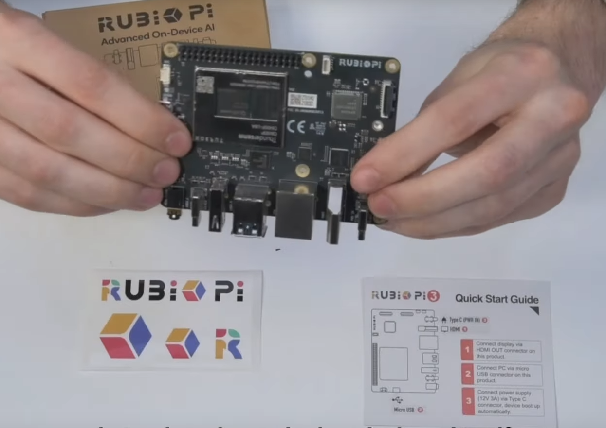

* 魔方派 3

* 魔方派贴纸

* 快速开始卡片
</TabItem>
<TabItem value="Intro" label="熟悉板卡">

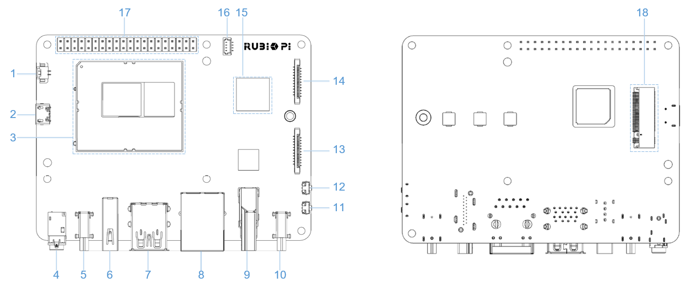

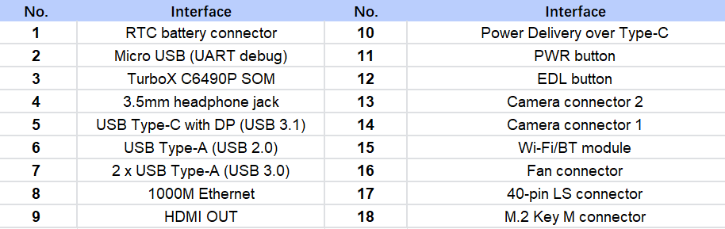
</TabItem>
<TabItem value="typflow" label="常规工作流">


| Task                | Operation                                                                 |
|---------------------|--------------------------------------------------------------------------|
| 设置设备   | <p>1. 设置调试串口。</p><p>2. 验证 Ubuntu 24.04 版本。</p><p>3. 连接到网络，连接到 SSH 和 HDMI 显示器。</p> |
| 运行示例应用程序 | 运行多媒体和 AI 示例应用程序。                                |
| 更新软件     | <p>1. 下载镜像。</p><p>2. 使设备进入紧急下载（EDL）模式。</p><p>3. 配置通用闪存存储 (UFS)，并刷写配置数据表。（CDT）</p><p>4. 使用 Qualcomm Download (QDL) 工具进行刷写。</p> |
</TabItem>
<TabItem value="accessory" label="支持配件清单">

The following accessories have been verified to work normally with RUBIK Pi 3:

* [Raspberry Pi Active Cooler](https://www.raspberrypi.com/products/active-cooler/)

* [Raspberry Pi High Quality Camera（IMX477/M12 Mount）](https://www.raspberrypi.com/products/raspberry-pi-high-quality-camera/)

* [Raspberry Pi Camera Module 2 (IMX219)](https://www.raspberrypi.com/products/camera-module-v2/)

* [Sense HAT](https://www.raspberrypi.com/products/sense-hat/)

* [Raspberry Pi 45W USB-C Power Supply](https://www.raspberrypi.com/products/45w-power-supply/)

* [Raspberry Pi 27W USB-C Power Supply](https://www.raspberrypi.com/products/27w-power-supply/)
</TabItem>
</Tabs>

<a id="setupdev"></a>
## 设置设备

魔方派 3 预装了软件，可快速设置设备。您可以使用基于 Ubuntu、Windows(®) 和 macOS(®) 的主机无缝配置魔方派 3。

:::note
您可以根据 [更新软件](1.Quick%20Start.md#updateSW) 章节为魔方派 3 安装最新的 Ubuntu24.04 系统。
:::

### 启动设备

&#x20;连接 12V 3A Type-C 电源适配器，然后执行以下之一：

* 按住电源按钮 2 秒，直到绿色 LED 灯有一次闪烁。

* 插入 USB Type-C 转 USB Type-A 或 Type-C 线以建立 ADB 连接并刷写软件。

:::note

魔方派 3 集成了 Power Delivery 协议的协商 IC， 最高支持 PD 3.0。为了获得最好的体验，推荐使用支持 **12V 3A PD 3.0** 协议的 Type-C 接口电源适配器。

当电源适配器符合规格并成功协商后，电源接口附近的指示灯亮起。不满足以上条件的电源适配器设备，电源指示灯将不会点亮并无法开机。
:::
在 V02 及 V02 以后的硬件中，连接好电源适配器，板子将自动开机，无需按下电源按钮。

若板子上的蓝灯一直亮起，则说明按下电源按钮的时间过长，板子处于 fastboot 模式；
若要退出 fastboot 模式，可使用下面的方法之一：

1. 在串口终端中敲回车。

2. 在主机中输入 fastboot reboot 命令。

3. 拔掉电源，重新启动。


<a id="setUART"></a>
### 设置调试 UART

调试 UART 显示诊断消息并通过 UART shell 提供对设备的访问。

1. 将 Micro-USB 线的一端连接到魔方派 3 设备上的 Micro-USB 端口。

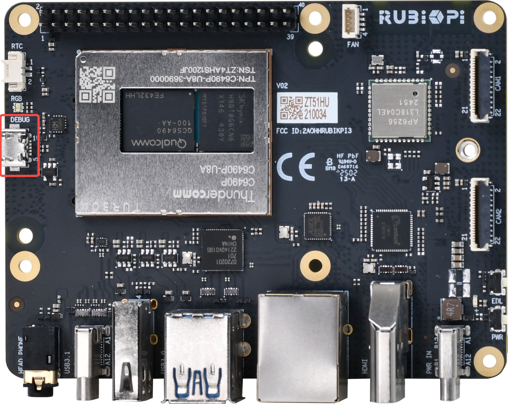

2. 将 Micro-USB 线的另一端连接到主机。
根据主机操作系统选择一个选项以获取详细说明。

<Tabs>
<TabItem value="Ubuntuhost" label="Ubuntu 主机">

1. 要在 Ubuntu 主机上安装 minicom 应用程序，请运行以下命令：&#x20;

   ```shell
   sudo apt update
   sudo apt install minicom
   ```

2. 要验证 USB 端口，请运行以下命令：

   ```shell
   ls /dev/ttyACM*
   ```

   Sample output

   ```shell
   /dev/ttyACM0
   ```

3. 要打开调试 UART，请运行以下命令：

   ```shell
   sudo minicom -D <serial_port>
   ```

示例命令: `sudo minicom -D /dev/ttyACM0`

4. 打开调试 UART 并按 Enter 以打开身份验证提示。

5. 通过下面内容，登陆 UART 控制台，并根据提示重置密码：

    * 账号： `ubuntu`

    * 密码： `ubuntu`

:::tip

如果您没有按预期看到身份验证控制台，请检查 USB 连接。如果需要，请断开并重新连接 Micro USB。

:::
</TabItem>
<TabItem value="winhost" label="Windows 主机">

1. 为您的 Windows 主机下载 [PuTTY](https://www.putty.org/)。确保为您的 Windows 选择正确的版本（32 位或 64 位）。
2. 运行安装向导并按提示操作。
3. 安装后，从开始菜单中的已安装程序列表中打开 PuTTY 应用程序，或使用任务栏中的搜索栏进行搜索。
4. 在 PuTTY Configuration 对话框中，执行以下操作：
    1. 选择 Serial。
    2. 根据 Windows Device Manager 上检测到的 UART 端口指定 Serial line。

   :::note

   如果未检测到 UART 端口，请下载驱动程序并使用 Windows Device Manager 来更新驱动程序：

   * 在 x86 上: [USB 转 UART 串行驱动程序](https://ftdichip.com/wp-content/uploads/2023/09/CDM-v2.12.36.4-WHQL-Certified.zip).

   * 在 Arm(®) 上: 转到 https://oemdrivers.com/usb-ft232r-usb-uart-arm64. 在 **Drivers** 中, 点击 **FTDI CDM VCP Drivers**.
   :::

   3. 将波特率设置为 115200。
   4. 选择 Open 以启动 PuTTY 会话。

    

5. 打开串行设备并按 Enter 键打开身份验证提示。
6. 通过下面内容，登陆 UART 控制台，并根据提示重置密码：
  - 帐号：ubuntu
  - 密码：ubuntu

:::tip

 如果您没有按预期看到身份验证控制台，请检查 USB 连接。如果需要，请断开并重新连接 Micro USB。
:::
</TabItem>
<TabItem value="machost" label="macOS 主机">

1. 要检查连接到 macOS 主机的串行设备，请运行以下命令：

   ```shell
   ls /dev/cu.*
   ```

2. 在串行设备列表中找到您的设备。

    

3. 要打开该串行设备，请运行以下命令：

    ```shell
    screen <serial_device_node> <baud_rate>
    ```

    :::note

    * 将 `<serial_device_node>` 替换为设备节点名称。

    * 将 `<baud_rate>` 替换为适当的波特率。
    :::

示例命令: `ceteam@Qualcomms-MacBook-Pro ~ % screen /dev/cu.usbserial-DM03SDQQ 115200`

4. 打开串行设备并按 **Enter** 键打开身份验证提示。

5. 通过下面内容，登陆 UART 控制台，并根据提示重置密码：
  - 帐号：ubuntu
  - 密码：ubuntu


:::tip

 如果您没有按预期看到身份验证控制台，请检查 USB 连接。如果需要，请断开并重新连接 Micro USB。
:::
</TabItem>
</Tabs>
### 验证软件版本

要验证 Ubuntu24.04 版本，请在设备 shell 中运行以下命令：

```shell
 cat /etc/os-release
```

输出显示 Ubuntu 版本。

```json
NAME="Ubuntu"
VERSION_ID="24.04"
VERSION="24.04.2 LTS (Noble Numbat)"
VERSION_CODENAME=noble
ID=ubuntu
ID_LIKE=debian
HOME_URL="https://www.ubuntu.com/"
SUPPORT_URL="https://help.ubuntu.com/"
BUG_REPORT_URL="https://bugs.launchpad.net/ubuntu/"
PRIVACY_POLICY_URL="https://www.ubuntu.com/legal/terms-and-policies/privacy-policy"
UBUNTU_CODENAME=noble
LOGO=ubuntu-logo
```

<a id="conNET"></a>
### 连接到网络

使用以下方法之一建立互联网连接以获取设备 IP 地址。

<Tabs>
   <TabItem value="ETH" label="使用以太网连接">

1. 将以太网线的一端插入魔方派 3 的以太网端口（RJ45），并将另一端连接到网络路由器。

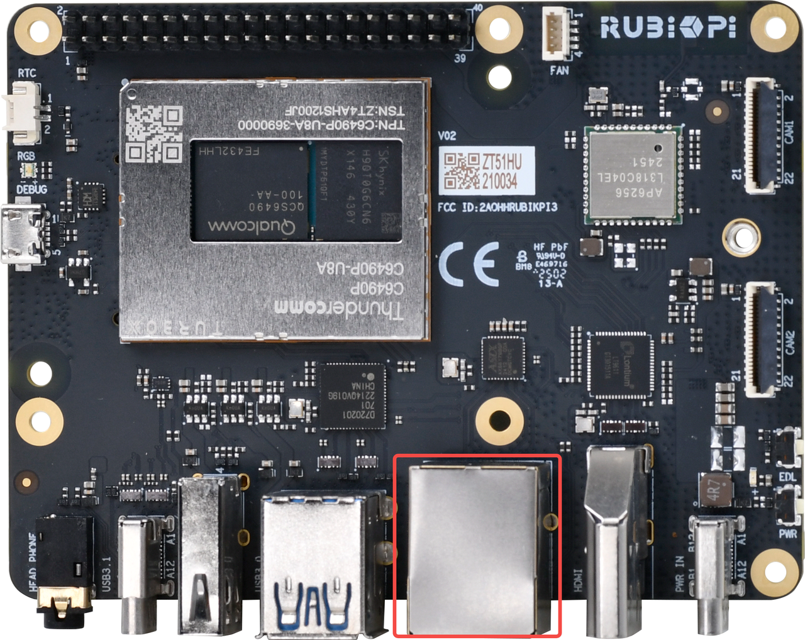

2. 建立连接后，在 UART 串行控制台上运行以下命令以获取 IP 地址：

    ```shell
    ip addr
    ```

    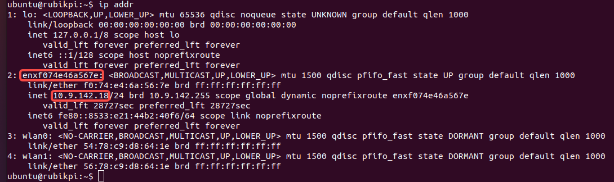
  </TabItem>
  <TabItem value="WiFi" label="使用 Wi-Fi 连接">

设备在 Station 模式下运行 Wi-Fi。当设备启动时，它会初始化 Wi-Fi host 驱动程序并进行网络管理身份验证。用户可以使用 nmcli 命令行工具建立无线连接。

1. 要连接到无线接入点（Wi-Fi 路由器），请运行以下命令：

   ```shell
   nmcli dev wifi connect <WiFi-SSID> password <WiFi-password>
   ```

    示例:

    ```
    nmcli dev wifi connect RUBIKPiWiFi password 1234567890
    ```
    ```
    Device ‘wlan0’ successfully activated with ‘d7b990bd-3b77-4b13-b239-b706553abaf8’.
    ```

2. 要验证连接和设备状态，请运行以下命令：

      ```shell
      nmcli -p device
      ```

    

3. 要验证 WLAN  连接状态和 IP 地址，请运行以下命令：

    ```shell
    ip addr
     ```

     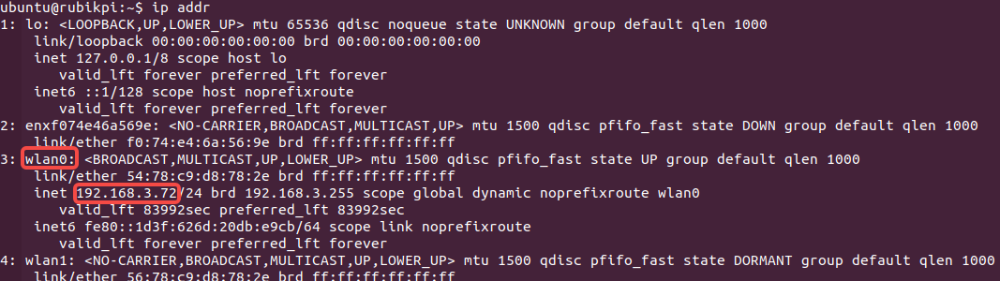

4. 为了确保连接处于活动状态，请对魔方派等网站执行 ping 操作：

     ```shell
    ping rubikpi.ai
     ```
 </TabItem>
</Tabs>

### 连接到 SSH

SSH 用于主机和魔方派之间的安全文件传输。
在连接到 SSH 之前，请确保网络连接。

1. 要根据网络连接类型查找魔方派的 IP 地址，请在 UART 控制台中运行下面的命令：

   ```shell
   ip addr
   ```

2. 从主机运行以下命令以建立与设备的 SSH 连接。使用通过步骤 1 获得的 IP 地址。

   ```shell
   ssh <user name>@ip-address
   ```

    示例：
    ```
    ssh ubuntu@192.168.0.222
    ```

3. 要连接到 SSH，请输入用户的密码。

    :::note

    确保主机连接到与设备相同的 Wi-Fi 接入点。
    :::

<a id="conHDMI"></a>
### 连接 HDMI 显示器

为了使用 HDMI 显示器并查看 Ubuntu24.04 的桌面显示和示例应用程序的输出，请按照以下步骤操作：

1. 将 HDMI 线的一端连接到魔方派 3 设备上的 HDMI 端口。

2. 将 HDMI 线的另一端连接到显示器。

这样您就可以在连接的显示器上查看 Ubuntu24.04 的桌面显示与示例应用程序的输出。

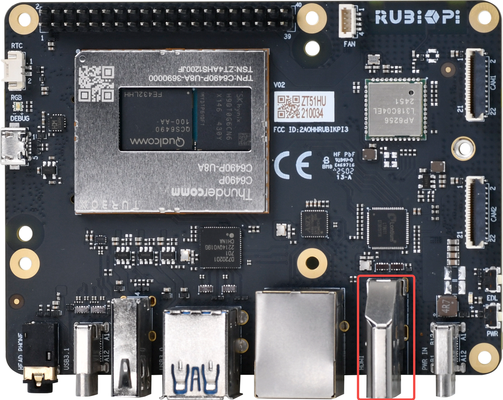

打开设备电源并检查 HDMI 显示。

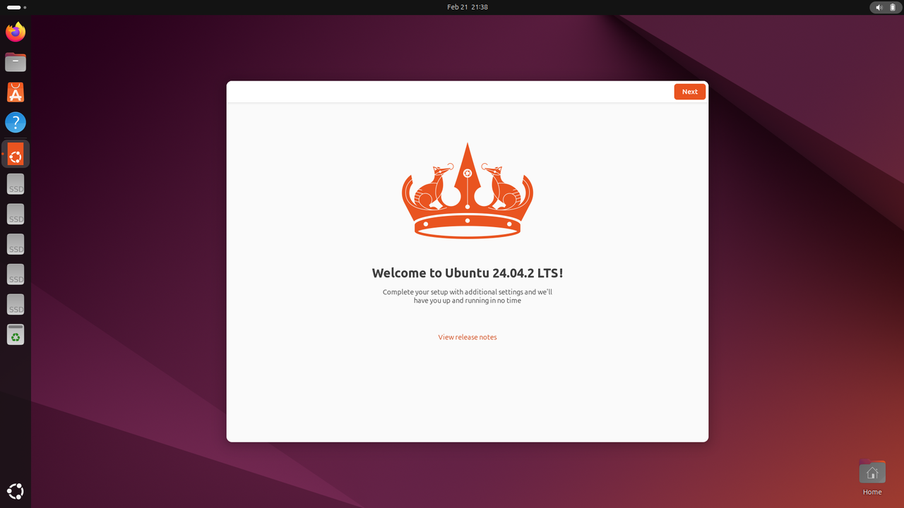

<a id="runsample"></a>
## 运行示例应用程序

魔方派 Ubuntu24.04 包括各种示例应用程序。相关详细信息，请参见示例应用程序。 TODO：示例应用程序跳转到 AI 和机器人章节。

您可以使用以下方法之一运行这些应用程序：

- 使用 RUBIK Pi Tools（一款基于 GUI 的应用程序）运行示例应用程序。

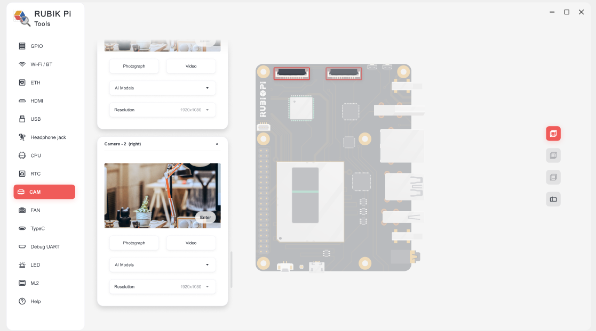

* 手动运行示例应用程序：

  * [运行多媒体示例程序](1.Quick%20Start.md#runmediaapp)

  * [运行 AI 示例程序](1.Quick%20Start.md#runsampleapp)

:::note

  * 要运行多媒体和 AI 应用程序，请设置 Wi-Fi 并建立 SSH 连接。
  * 要查看显示输出，请将 HDMI 显示屏连接到魔方派 3  HDMI 端口（参见 [连接 HDMI 显示器](1.Quick%20Start.md#conHDMI)）。
  * 要启用音频，请参见魔方派 音频 章节。

:::

<a id="prererunsample"></a>
### 示例程序运行前提条件

在运行示例程序前，需要使能 Weston 显示，用来启用完整的摄像头和 AI 功能，使能步骤如下：

1. 将 Qualcomm PPA 添加到 Ubuntu 源

    1. 将 Qualcomm 公共个人软件包档案 (PPA) 添加到您的魔方派 3 Ubuntu 软件源。

   ```shell
   sudo add-apt-repository ppa:ubuntu-qcom-iot/qcom-noble-ppa
   ```

   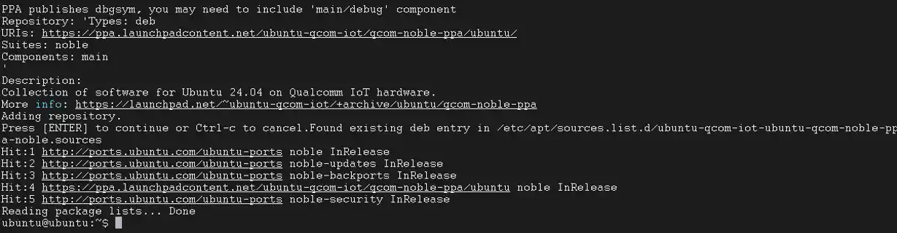

    2. 更新并安装依赖项。

   ```shell
   sudo apt update && sudo apt upgrade
   ```

2. 安装 Weston 并测试基本显示功能。

    1. 安装 Weston 和相关软件包。

   ```shell
   sudo apt install weston-autostart gstreamer1.0-qcom-sample-apps gstreamer1.0-tools qcom-fastcv-binaries-dev qcom-video-firmware weston-autostart libgbm-msm1 qcom-adreno1
   sudo reboot
   ```

   2. 以root用户身份设置显示环境。

   ```shell
   sudo -i
   export XDG_RUNTIME_DIR=/run/user/$(id -u ubuntu)
   ```

3. 插上HDMI屏幕，稍等片刻，Weston 桌面就会显示在屏幕上。

   :::note
   
   如果 Weston 桌面未正常显示，请尝试在魔方派终端中输入 `sudo dpkg-reconfigure weston-autostart` 命令。
   :::

4. 要测试图形，请运行示例应用。以下示例运行 Weston-simple-egl 示例。

   ```shell
   weston-simple-egl
   ```

   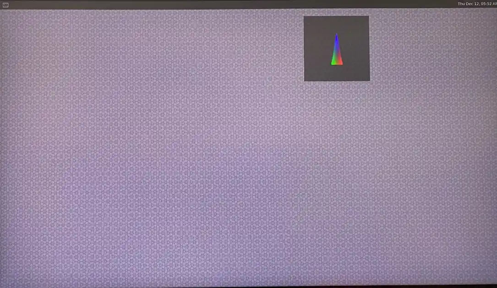

### 使用 RUBIK Pi Tools 运行示例应用程序

RUBIK Pi Tools 是一款基于 GUI 的应用程序，只需点击一下，即可体验魔方派开发套件的 AI 和多媒体功能。您无需设置主机即可开始使用此应用程序，并且可以连接到 Wi-Fi。

<a id="runmediaapp"></a>
### 运行多媒体示例应用程序

多媒体示例应用程序展示了魔方派设备上的摄像头、显示器和视频流的用例。

<Tabs>
   <TabItem value="dashcam" label="多摄像头流传输或编码（行车记录仪）">

`gst-multi-camera-example` 命令行应用程序展示了从魔方派 3 设备上的两个摄像头传感器同时进行流传输。该应用程序将摄像头传输的流进行并排合成并显示在显示器上，或将视频流进行编码并存储到文件中。


**使用示例**

Before running the application, make sure the [Weston display is enabled](./1.Quick%20Start.md#prererunsample). To launch the application, run the following use case from the SSH terminal:

运行前请 [使能 Weston 显示](./1.Quick%20Start.md#prererunsample)，要启动应用程序，请从 SSH 终端运行以下用例：

1. 安装摄像头相关软件

    1. 将魔方派 PPA 添加到 Ubuntu 源，并更新软件包列表

       ```shell
       sudo sed -i '$a deb http://apt.rubikpi.ai ppa main' /etc/apt/sources.list
       sudo apt update
       ```

    2. 安装摄像头软件

       ```shell
       sudo apt install -y qcom-ib2c qcom-camera-server qcom-camx
       sudo apt install -y rubikpi3-cameras
       sudo chmod -R 777 /opt
       sudo mkdir -p /var/cache/camera/
       sudo touch /var/cache/camera/camxoverridesettings.txt
       echo  enableNCSService=FALSE >> /var/cache/camera/camxoverridesettings.txt
       ```

2. 要在 HDMI 显示器上查看示例应用程序，请运行以下 export 命令：

    ```shell
    export XDG_RUNTIME_DIR=/run/user/$(id -u ubuntu)/ && export WAYLAND_DISPLAY=wayland-1
    ```

   :::note

    如果 Weston 未自动启用，请启动两个安全 shell 实例：一个用于启用 Weston，另一个用于运行应用程序。

    1. 要启用 Weston，请在第一个 shell 中运行以下命令：

        `export GBM_BACKEND=msm && export XDG_RUNTIME_DIR=/run/user/$(id -u ubuntu)/ && mkdir -p $XDG_RUNTIME_DIR && weston --continue-without-input --idle-time=0`

    2. 要设置 Wayland Display 环境，请在第二个 shell 中运行以下命令：

        `export XDG_RUNTIME_DIR=/run/user/$(id -u ubuntu)/ && export WAYLAND_DISPLAY=wayland-1`

   :::

3. 要查看 `waylandsink` 输出，请运行以下命令：

   ```shell
   gst-multi-camera-example -o 0
   ```

4. 要存储编码器输出，请执行以下操作：

    1. 运行以下命令：

       ```shell
       gst-multi-camera-example -o 1
       ```

       设备将编码后的文件分别存储在 `/opt/cam1_vid.mp4` 和 `/opt/cam2_vid.mp4` 中，分别用于摄像头 1 和摄像头 2。

    2. 要从主机提取文件，请运行以下命令：

        ```shell
        scp ubuntu@<IP address of target device>:/opt/cam1_vid.mp4 <destination directory>
        ```

    3. 要播放编码器输出，可以使用任何支持 MP4 文件的媒体播放器。

* 要停止用例，请按 **CTRL** + **C**。

* 要显示可用的帮助选项，可运行以下命令：

    ```shell
    gst-multi-camera-example --help
    ```

* `GST_DEBUG` 环境变量控制 GStreamer 调试输出。设置所需级别以允许日志记录。例如，要记录所有警告，可运行以下命令：

    ```shell
    export GST_DEBUG=2
    ```
</TabItem>
<TabItem value="wall" label="多通道视频解码与合成（视频墙）">

gst-concurrent-videoplay-composition 命令行应用程序允许对 AVC 编码的视频进行并发视频解码和播放，并将它们组合在显示器上用于视频墙应用。该应用程序至少需要一个输入视频文件，该文件应为 AVC codec 编码的 MP4 文件。

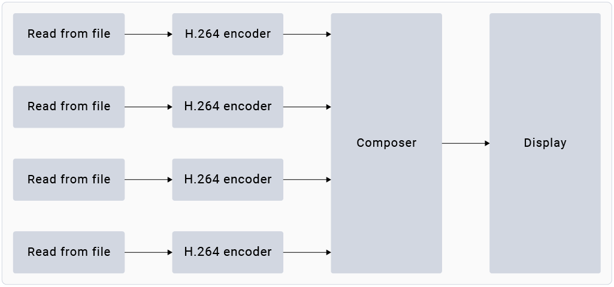

运行前请 [使能 Weston 显示](./1.Quick%20Start.md#prererunsample)，要启动应用程序，请从 SSH 终端运行以下用例：
1. 安装摄像头相关软件

    1. 将魔方派 PPA 添加到 Ubuntu 源，并更新软件包列表。

       ```shell
       sudo sed -i '$a deb http://apt.rubikpi.ai ppa main' /etc/apt/sources.list
       sudo apt update
       ```

   2.   2. 安装摄像头软件。

       ```shell
       sudo apt install -y qcom-ib2c qcom-camera-server qcom-camx
       sudo apt install -y rubikpi3-cameras
       sudo chmod -R 777 /opt
       sudo mkdir -p /var/cache/camera/
       sudo touch /var/cache/camera/camxoverridesettings.txt
       echo  enableNCSService=FALSE >> /var/cache/camera/camxoverridesettings.txt
      ```

2. 要将 AVC 编码的 MP4 (H.264) 格式的预先录制或测试视频（文件名为 `<file_name>`）传输到您的设备，可在主机上运行以下命令：

    ```shell
    scp <file_name> ubuntu@[DEVICE IP-ADDR]:/opt/
    ```

3. 要在 HDMI 显示器上查看示例应用程序，请从 SSH 终端运行以下 export 命令：

    ```shell
    export XDG_RUNTIME_DIR=/run/user/$(id -u ubuntu)/ && export WAYLAND_DISPLAY=wayland-1
    ```

:::note
如果 Weston 未自动启用，请启动两个安全 shell 实例：一个用于启用 Weston，另一个用于运行应用程序。

    1. 要启用 Weston，请在第一个 shell 中运行以下命令：
        `export GBM_BACKEND=msm && export XDG_RUNTIME_DIR=/run/user/$(id -u ubuntu)/ && mkdir -p $XDG_RUNTIME_DIR && weston --continue-without-input --idle-time=0`

    2. 要设置 Wayland Display 环境，请在第二个 shell 中运行以下命令：
        `export XDG_RUNTIME_DIR=/run/user/$(id -u ubuntu)/ && export WAYLAND_DISPLAY=wayland-1`

:::

4. 要启动四通道并发播放，请运行以下命令：

```shell
gst-concurrent-videoplay-composition -c 4 -i /opt/<file_name1>.mp4 -i /opt/<file_name2>.mp4 -i /opt/<file_name3>.mp4 -i /opt/<file_name4>.mp4
```

:::note

 * `-c`：指定要解码并合成的流的数量，可以是 2、4 或 8。

 * `-i`：指定输入视频文件的绝对路径。
:::

* 要停止用例，请按 &#x73;**&#x20;Ctrl** + **C**。
* 要显示可用的帮助选项，请运行以下命令：

```shell
gst-concurrent-videoplay-composition --help
```

* `GST_DEBUG` 环境变量控制 GStreamer 调试输出。设置所需级别以允许记录日志。例如，要记录所有警告，可运行以下命令：

```shell
export GST_DEBUG=2
```
</TabItem>
</Tabs>

<a id="runsampleapp"></a>
### 运行 AI 示例应用程序

AI 示例应用程序展示了在魔方派 3 设备上对来自摄像头、视频文件或实时流传输协议 (RTSP) 流的输入流进行对象检测和并行推理的用例。要运行这些示例应用程序，您必须从 [Qualcomm® AI Hub](https://aihub.qualcomm.com/iot/models) 获取 AI 模型并从 GitHub 获取标签。该过程包括下载模型和标签、将它们传输到魔方派 3 设备以及运行示例应用程序。


**前提条件**

设备上需要有模型和标签文件才能运行 AI 示例应用程序。

<a id="proced"></a>
**步骤**

运行前请 [使能 Weston 显示](./1.Quick%20Start.md#prererunsample)，要启动应用程序，请从 SSH 终端运行以下用例：

1. 安装摄像头相关软件

    1. 将魔方派 PPA 添加到 Ubuntu 源，并更新软件包列表。

       ```shell
       sudo sed -i '$a deb http://apt.rubikpi.ai ppa main' /etc/apt/sources.list
       sudo apt update
       ```

    2. 安装摄像头软件。

       ```shell
       sudo apt install -y qcom-ib2c qcom-camera-server qcom-camx
       sudo apt install -y rubikpi3-cameras
       sudo chmod -R 777 /opt
       sudo mkdir -p /var/cache/camera/
       sudo touch /var/cache/camera/camxoverridesettings.txt
       echo  enableNCSService=FALSE >> /var/cache/camera/camxoverridesettings.txt
       ```

2. 您需要以下用于 AI 示例应用程序的模型：

    | Sample Application         | Required Model                          | Required label file          |
    |----------------------------|-----------------------------------------|------------------------------|
    | AI object detection        | yolov8_det_quantized.tflite             | yolonas.labels               |
    | Parallel AI inference      | yolov8_det_quantized.tflite             | yolov8.labels                |
    | Parallel AI inference      | inception_v3_quantized.tflite           | classification.labels        |
    | Parallel AI inference      | hrnet_pose_quantized.tflite             | hrnet_pose.labels            |
    | Parallel AI inference      | deeplabv3_plus_mobilenet_quantized.tflite | deeplabv3_resnet50.labels    |

3. 下载并运行自动化脚本以获取设备上的模型和标签文件：

    ```shell
    curl -L -O https://raw.githubusercontent.com/quic/sample-apps-for-qualcomm-linux/refs/heads/main/download_artifacts.sh
    ```

    ```shell
    chmod +x download_artifacts.sh
    ```

    ```shell
    ./download_artifacts.sh -v GA1.4-rel -c QCS6490
    ```

:::note

 YOLOv8 模型不是脚本的一部分。您需要使用 Qualcomm AI Hub API 导出这些模型。

:::

4. 4. 从 Qualcomm AI Hub 导出 YOLOv8。


按照这些说明，将模型导出到您的主机上。您还可以通过 Windows Subsystem for Linux (WSL) 在 Windows 上运行这些指令，或在 macOS 上设置 Ubuntu 22.04 虚拟机。有关更多详细信息，请参阅虚拟机搭建指南。&#x20;

       1. 获取用于导出模型的 shell 脚本：

          ```shell
          wget https://raw.githubusercontent.com/quic/sample-apps-for-qualcomm-linux/refs/heads/main/scripts/export_model.sh
          ```

        2. 更新脚本权限以使其可执行：

          ```shell
          chmod +x export_model.sh
          ```

       3. 使用您的 Qualcomm AI Hub API 令牌作为 --api-token 参数的值运行 export 脚本：

          ```shell
          ./export_model.sh --api-token=<Your AI Hub API Token>
          ```

       :::note
       You can find your Qualcomm AI Hub API token in your [account settings](https://app.aihub.qualcomm.com/account/).
       您可以在 [account settings](https://app.aihub.qualcomm.com/account/) 中找到您的 Qualcomm AI Hub API 令牌。
       :::

        4. 该脚本会将模型下载到 build 目录。使用以下命令将这些模型复制到设备的 */etc/models/* 目录：

          ```shell
          scp <working directory>/build/yolonas_quantized/yolonas_quantized.tflite ubuntu@<IP address of target device>:/etc/models/
          ```

          ```shell
          scp <working directory>/build/yolov8_det_quantized/yolov8_det_quantized.tflite ubuntu@<IP address of target device>:/etc/models/
          ```


5. 更新 JSON 文件中量化 LiteRT 模型的 `q_offset` 和 `q_scale` 常量。有关说明，请参阅获取模型常量。

6. 使用以下命令将下载的模型文件推送到设备上：

    ```shell
    scp <model filename> ubuntu@<IP addr of the target device>:/etc/models
    ```

    示例：

    ```shell
    unzip rubikpi3_ai_sample_apps_models_labels.zip
    cd rubikpi3_ai_sample_apps_models_labels
    scp inception_v3_quantized.tflite ubuntu@<IP addr of the target device>:/etc/models/
    scp yolonas.labels ubuntu@<IP addr of the target device>:/etc/labels/
    ```

7. 使用以下命令为测试视频创建目录：

    ```shell
    ssh ubuntu@<ip-addr of the target device>
    ```

    ```shell
    mount -o remount, rw /usr
    ```

    ```shell
    mkdir /etc/media/
    ```

8. 从主机将测试视频文件推送到设备：

    ```shell
    scp <filename>.mp4 ubuntu@<IP address of target device>:/etc/media/
    ```


<Tabs>
<TabItem value="AIobject" label="AI 目标检测">

gst-ai-object-detection 示例应用程序展示了对来自摄像头、视频文件或 RTSP 流的输入流执行目标检测的硬件能力。该 pipeline 接收输入流，对其进行预处理，在 AI 硬件上运行推理，并在屏幕上显示结果。


**使用示例**

必须将模型和标签文件推送到设备才能运行示例应用程序。有关详细信息，请参阅 [过程](./1.Quick%20Start.md#proced)。

1. 开始新的 SSH 会话并启动 HDMI 显示器（如果尚未启动）：

    ```xml
    ssh ubuntu@<ip-addr of the target device>
    ```

2. 要在 HDMI 显示器上查看示例应用程序，请从 SSH 终端运行以下 export 命令：

    ```typescript
    export XDG_RUNTIME_DIR=/run/user/$(id -u ubuntu)/ && export WAYLAND_ DISPLAY=wayland-1
    ```

:::note

如果 Weston 未自动启用，请启动两个安全 shell 实例：一个用于启用 Weston，另一个用于运行应用程序。

    1. 要启用 Weston，请在第一个 shell 中运行以下命令：
        `export GBM_BACKEND=msm && export XDG_RUNTIME_DIR=/run/user/$(id -u ubuntu)/ && mkdir -p $XDG_RUNTIME_DIR && weston --continue-without-input --idle-time=0`

    2. 要设置 Wayland Display 环境，请在第二个 shell 中运行以下命令：
        `export XDG_RUNTIME_DIR=/run/user/$(id -u ubuntu)/ && export WAYLAND_DISPLAY=wayland-1`
:::

3. 编辑您设备上的 `/etc/configs/config_detection.json` 文件。

```json
{
   "file-path": "/etc/media/video.mp4",
   "ml-framework": "tflite",
   "yolo-model-type": "yolov8",
   "model": "/etc/models/yolov8_det_quantized.tflite",
   "labels": "/etc/labels/yolonas.labels",
   "constants": "YOLOv8,q-offsets=<21.0, 0.0, 0.0>,q-scales=<3.0546178817749023, 0.003793874057009816, 1.0>;",
   "threshold": 40,
   "runtime": "dsp"
}
```
| 字段           | 值/描述             |
|-----------------|--------------------|
| **ml-framework** | |
| snpe           | 使用 Qualcomm® Neural Processing SDK 模型 |
| tflite         | 使用 LiteRT 模型 |
| qnn            | 使用 Qualcomm® AI Engine direct 模型 |
| **yolo-model-type** | |
| yolov5 yolov8 yolonas | 分别运行 YOLOv5、YOLOv8 和 YOLO-NAS 模型。参见示例模型和标签文件。 |
| **runtime** | |
| cpu            | 在 CPU 上运行 |
| gpu            | 在 GPU 上运行 |
| dsp            | 在数字信号处理器 (DSP) 上运行 |
| **Input source** | |
| camera         | <p>0 – 主摄像头</p><p>1 – 辅助摄像头</p> |
| file-path      | 视频文件的目录路径。 |
| rtsp-ip-port   | RTSP 流的地址，格式为 `rtsp://<ip>:/<stream>` |

4. 要启动应用程序，请运行以下命令：

    ```python
    gst-ai-object-detection
    ```

* 要停止用例，请按&#x73;**&#x20;Ctrl** + **C**.

* 要显示可用的帮助选项，请运行以下命令：

    ```python
    gst-ai-object-detection -h
    ```

* `GST_DEBUG` 环境变量控制 GStreamer 调试输出。设置所需级别以允许记录日志。例如，要记录所有警告，可运行以下命令：

    ```c++
    export GST_DEBUG=2
    ```
</TabItem>

<TabItem value="parallelAI" label="并行 AI 推理">

gst-ai-parallel-inference 命令行应用程序演示了对来自摄像头、视频文件或 RTSP 流的输入流执行四个并行 AI 推理的硬件功能。该 pipeline 检测目标、对目标进行分类、检测姿态、并在输入流上分割图像。屏幕并排显示结果。


**使用示例**

必须将模型和标签文件推送到设备才能运行示例应用程序。有关详细信息，请参阅 [程序](./1.Quick%20Start.md#proced).

1. 开始新的 SSH 会话并启动 HDMI 显示器（如果尚未启动）：

```xml
ssh ubuntu@<ip-addr of the target device>
```

2. 要在 HDMI 显示器上查看示例应用程序，请从 SSH 终端运行以下 export 命令：

```typescript
export XDG_RUNTIME_DIR=/run/user/$(id -u ubuntu)/ && export WAYLAND_ DISPLAY=wayland-1
```

:::note

如果 Weston 未自动启用，请启动两个安全 shell 实例：一个用于启用 Weston，另一个用于运行应用程序。

    1. 要启用 Weston，请在第一个 shell 中运行以下命令：
        `export GBM_BACKEND=msm && export XDG_RUNTIME_DIR=/run/user/$(id -u ubuntu)/ && mkdir -p $XDG_RUNTIME_DIR && weston --continue-without-input --idle-time=0`

    2. 要设置 Wayland Display 环境，请在第二个 shell 中运行以下命令：
        `export XDG_RUNTIME_DIR=/run/user/$(id -u ubuntu)/ && export WAYLAND_DISPLAY=wayland-1`

:::

3. 使用以下命令将下载的模型文件推送到设备上：

```shell
scp <model filename> ubuntu@<IP addr of the target device>:/etc/models
```

示例

```shell
unzip rubikpi3_ai_sample_apps_models_labels.zip
cd rubikpi3_ai_sample_apps_models_labels
scp yolov8_det_quantized.tflite ubuntu@<IP addr of the target device>:/etc/models/
scp yolov8.labels ubuntu@<IP addr of the target device>:/etc/labels/

scp inception_v3_quantized.tflite ubuntu@<IP addr of the target device>:/etc/models/
scp classification.labels ubuntu@<IP addr of the target device>:/etc/labels/

scp hrnet_pose_quantized.tflite ubuntu@<IP addr of the target device>:/etc/models/
scp hrnet_pose.labels ubuntu@<IP addr of the target device>:/etc/labels/

scp deeplabv3_plus_mobilenet_quantized.tflite ubuntu@<IP addr of the target device>:/etc/models/
scp deeplabv3_resnet50.labels ubuntu@<IP addr of the target device>:/etc/labels/
```

4. 要启动应用程序，请运行以下命令：

```plain&#x20;text
gst-ai-parallel-inference
```

* 要停止用例，请按&#x73;**&#x20;Ctrl** + **C**.

* 要显示可用的帮助选项，请运行以下命令：

```plain&#x20;text
gst-ai-parallel-inference -h
```

* Qualcomm AI Hub 经常使用最新的 SDK 版本更新模型。使用错误的模型常量可能会导致结果不准确。如果您遇到此类问题，请更新模型常量。可以使用以下命令为示例应用程序提供模型常量：

```python
gst-ai-parallel-inference -s /etc/media/video.mp4 \
--object-detection-constants="YOLOv8,q-offsets=<21.0, 0.0, 0.0>,q-scales=<3.0546178817749023, 0.003793874057009816, 1.0>;" \
--pose-detection-constants="Posenet,q-offsets=<8.0>,q-scales=<0.0040499246679246426>;" \
--segmentation-constants="deeplab,q-offsets=<0.0>,q-scales=<1.0>;" \
--classification-constants="Inceptionv3,q-offsets=<38.0>,q-scales=<0.17039915919303894>;"
```

* `GST_DEBUG` 环境变量控制 GStreamer 调试输出。设置所需级别以允许记录日志。例如，要记录所有警告，可运行以下命令：

```c++
export GST_DEBUG=2
```

已知问题

在姿态检测中，即使帧中有多个人，模型也只检测一个人。

:::note

使用 Inception v3 模型的图像分类是在 ImageNet 数据集上进行训练的。因此，由于该类不包含在数据集中，因此模型无法检测到人。

:::
</TabItem>
</Tabs>

### 更多应用程序

发布版本提供了各种示例应用程序。要了解更多信息，请参阅示例应用程序。


## 开发您自己的应用程序

You can create applications using the Qualcomm(®) Visual Studio Code Extension.

For more information, refer to [Qualcomm Visual Studio Code Extension Reference Guide](https://docs.qualcomm.com/bundle/publicresource/topics/80-79972-1/quick_start.html).

您可以使用 Qualcomm(®) Visual Studio Code Extension 创建应用程序。

有关更多信息，请参阅 [Qualcomm Visual Studio Code Extension Reference Guide](https://docs.qualcomm.com/bundle/publicresource/topics/80-79972-1/quick_start.html)。

Qualcomm(®) Visual Studio Code Extension 可能不支持 Ubuntu24.04 软件版本。

<a id="updateSW"></a>
## 更新软件

本节介绍如何在运行 Ubuntu、Windows 或 mac 操作系统的不同主机上，将预编译镜像下载并刷写到魔方派 3 设备上。


:::warning

使用预编译镜像更新软件会擦除设备上的所有数据并安装新的镜像。请确保在开始之前备份重要数据。

:::

### 下载软件

访问 [RUBIK Pi 3 官方网站](https://www.thundercomm.com/rubik-pi-3/en/docs/image) 进行 Ubuntu24.04 软件版本下载。

<a id="enterEDL"></a>
### 进入 EDL 模式


<Tabs>
<TabItem value="method1" label="方法 1">

1. 按住上图 12 的 EDL 按钮。

   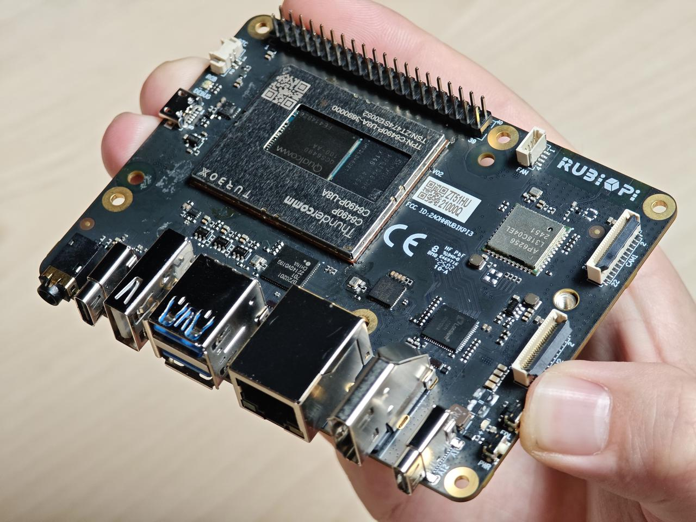

2. 将供电线接入到上图 10。

   

3. Type-C 数据线插入上图 5 等待 3 秒，进入 9008 模式。

   
</TabItem>
<TabItem value="method2" label="方法 2">

1. 将供电线接入到上图 10。

   

2. Type-C 数据线插入上图 5。

   

3. 在 RUBIK Pi 3 开机后，输入如下命令，进入 9008 模式。

   ```shell
   adb shell reboot edl
   ```
</TabItem>
</Tabs>

<a id="flashQDL"></a>
### 使用 QDL 工具进行烧录

QDL 是一款烧录工具，通过 QDL 可向魔方派中烧录镜像。

[点击此处下载](https://softwarecenter.qualcomm.com/api/download/software/tools/Qualcomm_Device_Loader/All/2.3.4/Qualcomm_Device_Loader.Core.2.3.4.All-AnyCPU-qdl_2.3.4.zip)
QDL，下载完成后解压，文件内容如下所示，QDL 支持多平台多架构，可通过查看 *QDL_User_Guide.pdf* 了解 QDL 的使用方法。


<Tabs>
<TabItem value="uhost" label="Ubuntu 主机">

1. 执行下面命令安装 libusb 和 libxml2（若已经安装，可忽略该步骤）。

```shell
sudo apt-get install libxml2-dev libudev-dev libusb-1.0-0-dev
```

2. 进入 FlatBuild 包的 *ufs* 目录。
3. 根据主机架构将 *QDL_Linux_x64* 或 *QDL_Linux_ARM* 目录下的 qdl 拷贝到 *ufs* 目录。
4. 执行下面命令进行烧录。

```shell
./qdl --storage ufs prog_firehose_ddr.elf rawprogram*.xml patch*.xml
```


5. 或烧录后无法启动，可尝试进入 FlatBuild 包中的 provision 目录执行下面命令重新对 UFS 进行配置（provision）。

:::warning
* 进行 provision 后，UFS 中存储的一些信息会丢失，如 SN号、以太网MAC地址等。
* 配置前，根据主机架构将 *QDL_Linux_x64* 或 *QDL_Linux_ARM* 目录下的 qdl 拷贝到 *provision* 目录
:::

```shell
./qdl prog_firehose_ddr.elf provision_ufs_1_3.xml
```


:::note
 Provison 刷机完成之后，需要手动插拔电源线和 USB 线重启设备重新进行镜像烧录。
:::
</TabItem>
<TabItem value="whost" label="Windows 主机">

1. 安装 WinUSB 驱动（若已经安装可忽略该步骤）

   1. 卸载该设备的其他驱动程序。确保未安装 Qualcomm USB 驱动程序等驱动程序。

      * 您不应该在设备管理器的 COM 端口下看到魔方派设备，如下所示，如果您在 COM 端口下看到该设备，请右键该设备，选择删除设备。

      

      * 确保已选中“删除此设备的驱动程序软件”。

      

   2. 设备断电，重新进入烧录模式，使用以下说明/屏幕截图安装 Microsoft WinUSB。

      * 在设备管理器中右键 RUBIK Pi 的 USB 端口，选择更新驱动程序。

      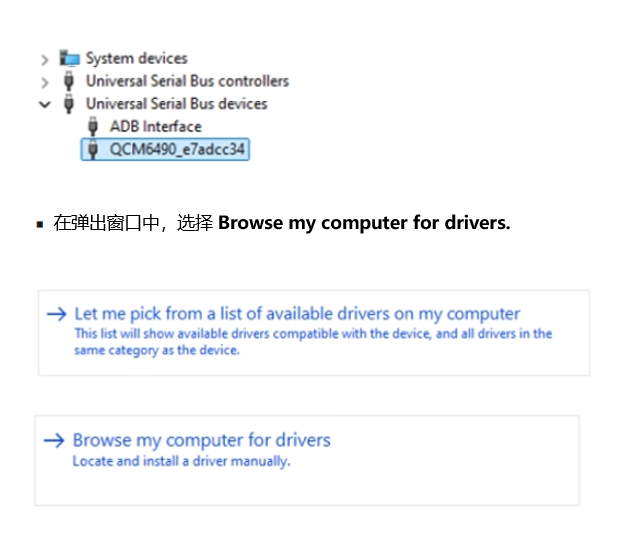

      * 在通用串行总线设备中，选择 "WinUsb Device"。

      

      * 点 “是”，完成驱动更新。

      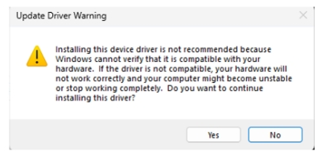

2. 在终端中使用以下命令根据主机架构运行 *QDL_Win_x64* 或 *QDL_Win_ARM64* 目录中的 QDL 可执行文件, 进行镜像烧录,

:::note
 程序文件名不支持通配符。命令中必须列出每个镜像文件。

 将 `<pathToQDL>` 更换为 *QDL_Win_x64* 或 *QDL_Win_ARM64* 目录的实际位置。
:::

```shell
<pathToQDL>\QDL.exe prog_firehose_ddr.elf rawprogram0.xml rawprogram1.xml rawprogram2.xml rawprogram3.xml rawprogram4.xml rawprogram5.xml rawprogram6.xml patch0.xml patch1.xml patch2.xml patch3.xml patch4.xml patch5.xml patch6.xml
```


3. 或烧录后无法启动，可尝试进入 FlatBuild 包中的 provision 目录执行下面命令重新对 UFS 进行配置（provision）。

:::warning
 进行 provision 后，UFS 中存储的一些信息会丢失，如 SN号、以太网MAC地址等。

 将 `<pathToQDL>` 更换为 *QDL_Win_ARM64* 或 *QDL_Win_x64* 目录的实际位置。

:::

```shell
<pathToQDL>\QDL.exe prog_firehose_ddr.elf provision_ufs_1_3.xml
```


:::note
 Provison 刷机完成之后，需要手动插拔电源线和 USB 线重启设备重新进行镜像烧录。
:::
</TabItem>
<TabItem value="mhost" label="macOS 主机">

1. 使用以下方式安装 homebrew (若已经安装，可忽略该步骤)。

```shell
/bin/bash -c "$(curl -fsSL https://raw.githubusercontent.com/Homebrew/install/HEAD/install.sh)"
```

2. 执行下面命令安装 libusb 和 libxml2。

```shell
brew install libusb
brew install libxml2
```

3. 进入 FlatBuild 包的 *ufs* 目录。
4. 根据主机的架构将 *QDL_Mac_x64* 或 *QDL_Mac_ARM* 目录下的内容拷贝到 *ufs* 目录。
5. 执行下面命令进行烧录。

```shell
./qdl --storage ufs prog_firehose_ddr.elf rawprogram*.xml patch*.xml
```


6. 或烧录后无法启动，可尝试进入 FlatBuild 包中的 provision 目录执行下面命令重新对 UFS 进行配置（provision）。

:::note
 进行 provision 后，UFS 中存储的一些信息会丢失，如 SN 号、以太网 MAC 地址等。

 配置前，根据主机架构将 *QDL_Mac_x64* 或 *QDL_Mac_ARM* 目录下的 qdl 拷贝到 *provision* 目录
:::

```shell
./qdl prog_firehose_ddr.elf provision_ufs_1_3.xml
```

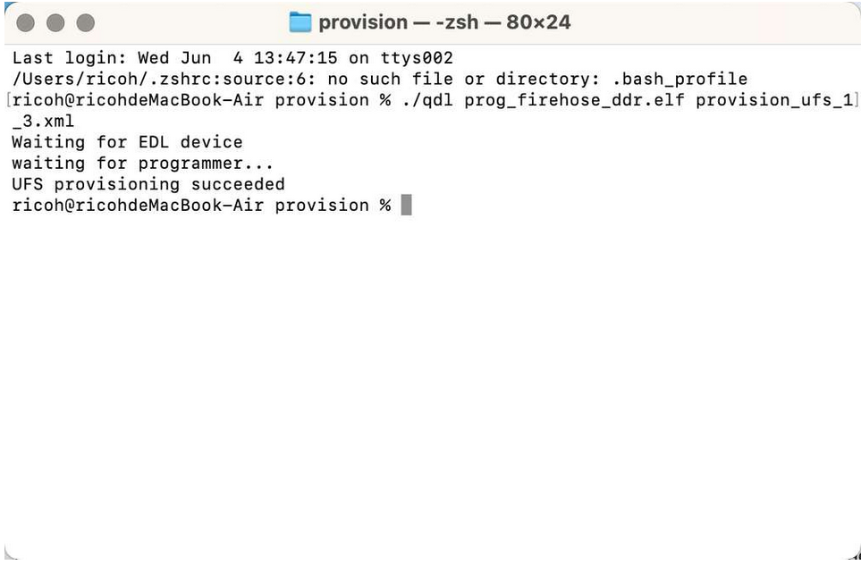

:::note
 Provison 刷机完成之后，需要手动插拔电源线和 USB 线重启设备重新进行镜像烧录。
:::
</TabItem>
</Tabs>

### 后续步骤

1. [设置设备](./1.Quick%20Start.md#setupdev)

2. [运行示例应用程序](./1.Quick%20Start.md#runsample)

## FAQ
* 如何恢复设备？
  1. 下载软件。
  2. 强制设备进入紧急下载 (EDL) 模式。
  3. 刷写下载的软件。

* 如何刷写配置参数表 (CDT)？
  CDT 提供平台或设备相关数据，例如平台 ID、子类型和版本。各种软件（驱动程序/固件）模块可以使用此信息来动态检测和初始化平台。默认已集成到软件包中，如有需要可按如下方式进行操作。

  :::note

  确保设备处于 EDL 模式。有关更多信息，请参阅 [进入 EDL 模式](./1.Quick%20Start.md#enterEDL)。
  :::

  1. 点击 [此处](https://thundercomm.s3.dualstack.ap-northeast-1.amazonaws.com/uploads/web/rubik-pi-3/tools/RUBIKPI_CDT.zip) 下载所需的 CDT。

  2. 要刷写 CDT，请运行以下命令：

  ```xml
  ./qdl prog_firehose_ddr.elf rawprogram3.xml patch3.xml
  ```

* 如何配置通用闪存存储 (UFS)？

  * 请参阅 [使用 QDL 工具进行刷写](./1.Quick%20Start.md#flashQDL)。

* 如何将设备强制进入 EDL 模式？

  * 请参阅 [进入 EDL 模式](./1.Quick%20Start.md#enterEDL)。

* 如何在主机上安装并连接 android debug bridge (ADB)？

 `adb` 命令可简化各种设备操作，例如调试、抓取内核日志以及将应用和文件推送到目标设备。

  1. Windows 主机请点击 [此处](https://thundercomm.s3.ap-northeast-1.amazonaws.com/uploads/web/rubik-pi-3/tools/qud/qud.win.1.1_installer_10061.1.zip) 下载 QUD 驱动。

  2. 在 Linux 主机上运行以下命令：

  ```powershell
  sudo apt install git android-tools-adb android-tools-fastboot wget
  ```

  3. 要验证 Linux 主机上 adb 的版本，请运行以下命令：

  ```css
  adb --version
  ```

  4. 使用 USB Type-C 线将 RubikPi 设备与主机连接。确保设备显示为 ADB 设备。

  ```plain&#x20;text
  adb devices
  ```

  5. 要进入 shell，请运行以下命令：

  ```plain&#x20;text
  adb shell
  ```

* 已经连接网络时，如何重新连接到不同的网络？

  1. 要断开当前网络，请运行以下命令：

  ```plain&#x20;text
  sudo nmcli c down <WiFi-SSID>
  ```

  示例

  ```shell

  ```shell
  sudo nmcli c down RUBIKPiWiFi
  ```
  ```shell
  Connection 'RUBIKPiWiFi' successfully deactivated (D-Bus active path: /org/freedesktop/NetworkManager/ActiveConnection/2)
  ```
  2. 要验证断开连接状态，请运行以下命令：

  ```css
  nmcli -p device
  ```

  

  3. 要连接到不同的 Wi-Fi 网络，请运行以下命令：

  ```shell
  nmcli dev wifi connect <WiFi-SSID> password <WiFi-password>
  ```

  示例

  ```shell
  nmcli dev wifi connect RUBIKPiWiFi password 1234567890
  ```
  ```shell
  Device ‘wlan0’ successfully activated with ‘d7b990bd-3b77-4b13-b239-b706553abaf8’.
  ```

* 如何使用 Minicom 来设置调试 UART？

  * 请参阅 [设置调试 UART](./1.Quick%20Start.md#setUART).

* 如何切换到root用户

  请运行下面的命令：

  ```shell
  sudo -i
  ```

* 如何从桌面版本切换为服务版本

  1. 参见 [连接到网络](./1.Quick%20Start.md#conNET) , 确保网络连接状态正常。

  2. 请执行以下命令从桌面版本切换为服务版本

  ```shell
  sudo add-apt-repository ppa:ubuntu-qcom-iot/qcom-noble-ppa 
  sudo apt update
  sudo apt upgrade -y
  sudo apt-get install qcom-adreno1
  sudo apt-get remove ubuntu-desktop
  sudo apt remove gdm3
  sudo reboot
  ```

* 如何从服务版本切换为桌面版本

  1. 参见 [连接到网络](./1.Quick%20Start.md#conNET) , 确保网络连接状态正常。

  2. 请执行以下命令从服务版本切换为桌面版本

  ```shell
  sudo add-apt-repository ppa:ubuntu-qcom-iot/qcom-noble-ppa
  sudo apt update
  sudo apt upgrade -y
  sudo apt install qcom-adreno1- libgbm-msm1- libegl-mesa0 libegl1 libgles2 libglvnd0 libvulkan1
  sudo apt install ubuntu-desktop
  sudo reboot
  ```

* 如何更新 USB 和以太网控制器的固件？

  1. 要下载固件，请注册并登录 [Renesas](https://www.renesas.com/) 网站。登录后，您可以从以下 [链接](https://www.renesas.com/us/en/products/interface/usb-switches-hubs/upd720201-usb-30-host-controller#design_development) 访问固件。

  2. 在 linux 主机上使用 scp 命令将固件拷贝到设备中

  ```python
  scp renesas_usb_fw.mem ubuntu@<WIFI-IP>:~
  ```

  3. 将固件添加到设备的image中

  ```python
  sudo cp ~ubuntu/renesas_usb_fw.mem /lib/firmware
  sudo mkinitramfs -o /boot/initrd.img-$(uname -r)
  sudo reboot
  ```
  4. 确认固件是否添加成功

  ```python
  sudo lsinitramfs /boot/initrd.img-$(uname -r) | grep renesas
  ```

* 如何对刷写相关的问题进行故障排除？

    :::note
    确保主机未运行 ModemManager 工具，因为它会干扰 QDL 刷写。
    :::

  如果您使用的是带有 systemd 的 Linux 发行版本，请使用以下命令停止 ModemManager 工具：

  ```css
  sudo systemctl stop ModemManager
  ```

  * 如果您需要 ModemManager，请在刷写完成后重新启动它。

  如果刷写失败，请执行以下操作并重试刷写过程：

  1. 关闭设备。

  2. 断开设备与主机的连接。

  3. 重新启动主机。

* 如何使用魔方派官方提供的外壳设计资料进行 3D 打印

### 进一步支持

在  [魔方派论坛](https://community.rubikpi.ai/)出您的问题。

## 深入研究

要进行深入了解，请仔细研读以下文档：

| Document               | Description |
|------------------------|-------------|
| Linux 内核           | 为你的魔方派配置和构建自定义内核 |
| 摄像头软件        | 描述魔方派的摄像头软件架构，在魔方派平台上进行摄像头应用开发 |
| 魔方派硬件      | 关于如何使用魔方派的硬件资源 |
| 人工智能 | 帮助您通过使用 Qualcomm Intelligent Multimedia Product (QIMP) SDK 在魔方派上进行人工智能应用开发 |
| 机器人开发 | 帮助您通过使用 Qualcomm Intelligent Robotics Product (QIRP) 为开发常规机器人用例提供环境 |
| 故障排除   | 常见问题与修复 |
| 物联网连接       | 帮助您在魔方派平台上运行物联网应用 |
| 数据手册             | 获取魔方派硬件参数 |


## 开发监管公告

此开发设备包含的 RF/数字硬件和软件仅用于工程开发、工程评估或演示目的，只能用于受控环境。此设备不允许投放到市场，租赁或出售后在住宅环境中使用，或作为最终用户终端供大众使用。
此开发设备不符合商用消费设备的要求，包括欧盟指令中商用无线设备的有关要求、FCC 设备授权法规或针对投放到市场并供大众使用的消费类终端的其他规范。

安装和操作该设备时，辐射天线和人员之间的最小距离应为 8 英寸（20 厘米）。可在 FCC 网站查看其他 RF 暴露信息，网址： http://www.fcc.gov/encyclopedia/radio-frequency-safety。
FCC 通知：该套件的设计允许下列用途：

1. 产品开发者评估与套件相关的电子器件、电路或软件，以确定是否将此类内容包含在成品中；

2. 软件开发者编写用于最终产品的软件应用程序。此套件不是成品，除非事先获得所有必要的 FCC 设备授权，否则组装后不得转售或以其他方式销售。操作必须满足相关条件，即此产品不得对合法的无线电台造成有害干扰，并且此产品可以接受有害干扰。除非组装后的套件设计为根据美国联邦通信委员会 (FCC) 规则第 47 章的第 15 部分、第 18 部分或第 95 部分操作，否则套件的操作员必须在 FCC 许可证持有者的授权下操作，或者必须根据 FCC 规则的第 5 部分获得实验授权。

如果通过添加外部 RF 器件（例如，高增益天线）对套件进行修改，则所有者必须确保操作符合现有法规。
