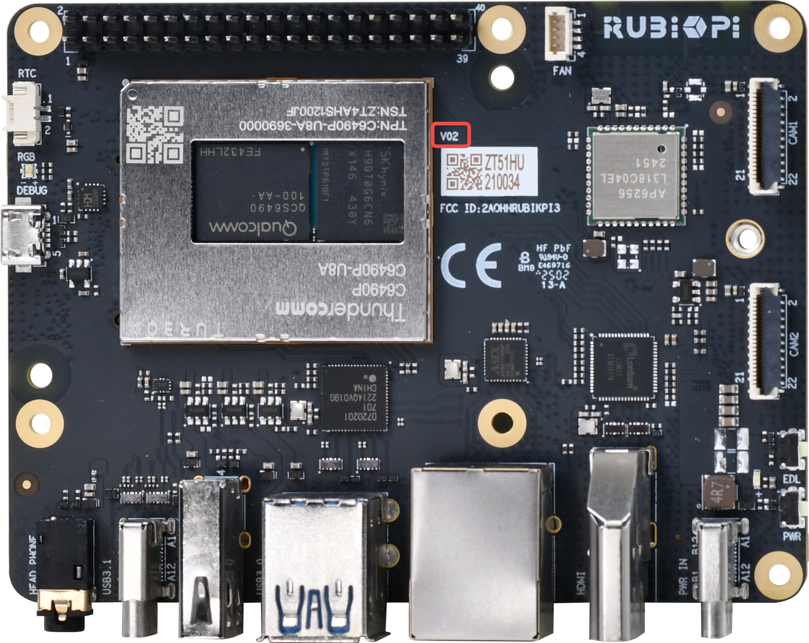
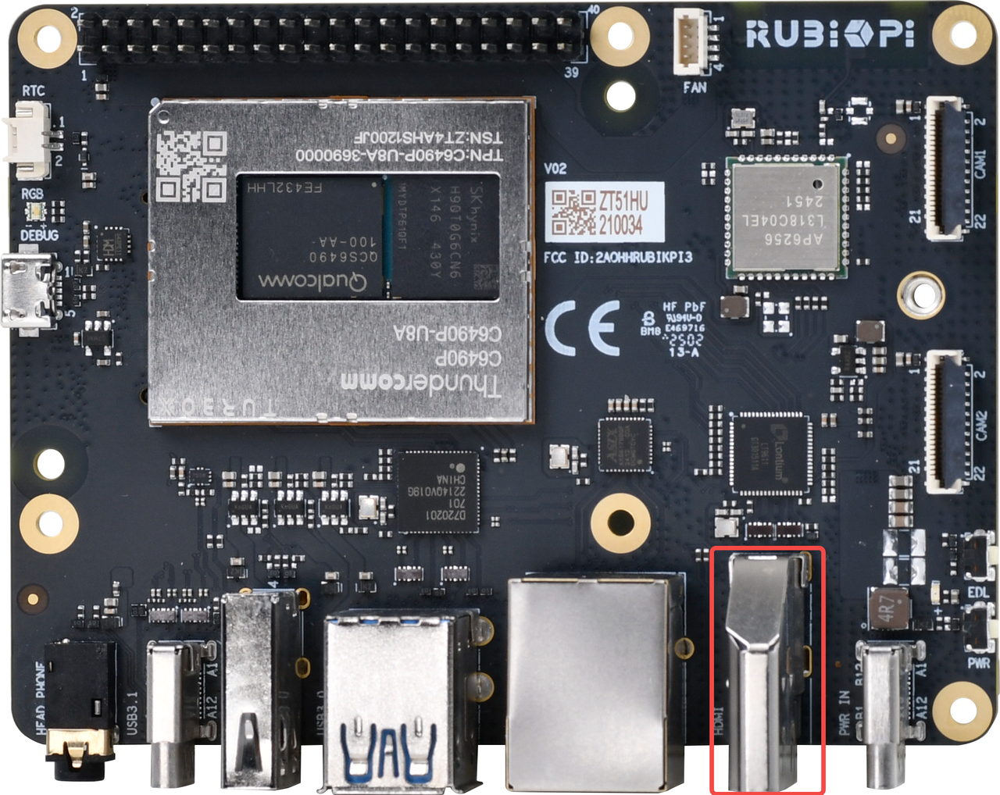

import Tabs from '@theme/Tabs';
import TabItem from '@theme/TabItem';

<a id="setupdev"></a>
# 设置设备

您可以使用基于 Ubuntu、Windows(®) 和 macOS(®) 的主机无缝配置魔方派 3。


:::note
您可以根据 [更新软件](2.更新软件.md#updateSW) 章节为魔方派 3 安装最新的 Ubuntu24.04 系统。
:::

## 启动设备

&#x20;连接 12V 3A Type-C 电源适配器，然后执行以下之一：

* 按住电源按钮 2 秒，直到绿色 LED 灯有一次闪烁。

* 插入 USB Type-C 转 USB Type-A 或 Type-C 线以建立 ADB 连接并刷写软件。

:::note

魔方派 3 集成了 Power Delivery 协议的协商 IC， 最高支持 PD 3.0。为了获得最好的体验，推荐使用支持 **12V 3A PD 3.0** 协议的 Type-C 接口电源适配器。

当电源适配器符合规格并成功协商后，电源接口附近的指示灯亮起。不满足以上条件的电源适配器设备，电源指示灯将不会点亮并无法开机。
:::
在 V02 及 V02 以后的硬件中，连接好电源适配器，板子将自动开机，无需按下电源按钮。可以查看板子上如下位置确定硬件版本号，如下硬件版本号为 V02。



若板子上的蓝灯一直亮起，则说明按下电源按钮的时间过长，板子处于 fastboot 模式；
若要退出 fastboot 模式，可使用下面的方法之一：

1. 在串口终端中敲回车。

2. 在主机中输入 fastboot reboot 命令。

3. 拔掉电源，重新启动。


<a id="setUART"></a>
## 设置调试 UART

调试 UART 显示诊断消息并通过 UART shell 提供对设备的访问。

1. 将 Micro-USB 线的一端连接到魔方派 3 设备上的 Micro-USB 端口。


2. 将 Micro-USB 线的另一端连接到主机。
根据主机操作系统选择一个选项以获取详细说明。

<Tabs>
<TabItem value="Ubuntuhost" label="Ubuntu 主机">

1. 要在 Ubuntu 主机上安装 minicom 应用程序，请运行以下命令：&#x20;

   ```shell
   sudo apt update
   sudo apt install minicom
   ```

2. 要验证 USB 端口，请运行以下命令：

   ```shell
   ls /dev/ttyACM*
   ```

   Sample output

   ```shell
   /dev/ttyACM0
   ```

3. 要打开调试 UART，请运行以下命令：

   ```shell
   sudo minicom -D <serial_port>
   ```

示例命令: `sudo minicom -D /dev/ttyACM0`

4. 打开调试 UART 并按 Enter 以打开身份验证提示。

5. 通过下面内容，登录 UART 控制台，并根据提示重置密码：

    * 账号： `ubuntu`

    * 密码： `ubuntu`

:::tip

如果您没有按预期看到身份验证控制台，请检查 USB 连接。如果需要，请断开并重新连接 Micro USB。

:::
</TabItem>
<TabItem value="winhost" label="Windows 主机">

1. 为您的 Windows 主机下载 [PuTTY](https://www.putty.org/)。确保为您的 Windows 选择正确的版本（32 位或 64 位）。
2. 运行安装向导并按提示操作。
3. 安装后，从开始菜单中的已安装程序列表中打开 PuTTY 应用程序，或使用任务栏中的搜索栏进行搜索。
4. 在 PuTTY Configuration 对话框中，执行以下操作：
    1. 选择 Serial。
    2. 根据 Windows Device Manager 上检测到的 UART 端口指定 Serial line。

   :::note

   如果未检测到 UART 端口，请下载驱动程序并使用 Windows Device Manager 来更新驱动程序：

   * 在 x86 上: [USB 转 UART 串行驱动程序](https://ftdichip.com/wp-content/uploads/2023/09/CDM-v2.12.36.4-WHQL-Certified.zip).

   * 在 Arm(®) 上: 转到 https://oemdrivers.com/usb-ft232r-usb-uart-arm64. 在 **Drivers** 中, 点击 **FTDI CDM VCP Drivers**.
   :::

   3. 将波特率设置为 115200。
   4. 选择 Open 以启动 PuTTY 会话。

    

5. 打开串行设备并按 Enter 键打开身份验证提示。
6. 通过下面内容，登录 UART 控制台，并根据提示重置密码：
  - 帐号：ubuntu
  - 密码：ubuntu

:::tip

 如果您没有按预期看到身份验证控制台，请检查 USB 连接。如果需要，请断开并重新连接 Micro USB。
:::
</TabItem>
<TabItem value="machost" label="macOS 主机">

1. 要检查连接到 macOS 主机的串行设备，请运行以下命令：

   ```shell
   ls /dev/cu.*
   ```

2. 在串行设备列表中找到您的设备。

    

3. 要打开该串行设备，请运行以下命令：

    ```shell
    screen <serial_device_node> <baud_rate>
    ```

    :::note

    * 将 `<serial_device_node>` 替换为设备节点名称。

    * 将 `<baud_rate>` 替换为适当的波特率。
    :::

示例命令: `ceteam@Qualcomms-MacBook-Pro ~ % screen /dev/cu.usbserial-DM03SDQQ 115200`

4. 打开串行设备并按 **Enter** 键打开身份验证提示。

5. 通过下面内容，登录 UART 控制台，并根据提示重置密码：
  - 帐号：ubuntu
  - 密码：ubuntu


:::tip

 如果您没有按预期看到身份验证控制台，请检查 USB 连接。如果需要，请断开并重新连接 Micro USB。
:::
</TabItem>
</Tabs>
## 验证软件版本

要验证 Ubuntu24.04 版本，请在设备 shell 中运行以下命令：

```shell
 cat /etc/os-release
```

输出显示 Ubuntu 版本。

```json
NAME="Ubuntu"
VERSION_ID="24.04"
VERSION="24.04.2 LTS (Noble Numbat)"
VERSION_CODENAME=noble
ID=ubuntu
ID_LIKE=debian
HOME_URL="https://www.ubuntu.com/"
SUPPORT_URL="https://help.ubuntu.com/"
BUG_REPORT_URL="https://bugs.launchpad.net/ubuntu/"
PRIVACY_POLICY_URL="https://www.ubuntu.com/legal/terms-and-policies/privacy-policy"
UBUNTU_CODENAME=noble
LOGO=ubuntu-logo
```

<a id="conNET"></a>
## 连接到网络

使用以下方法之一建立互联网连接以获取设备 IP 地址。

<Tabs>
   <TabItem value="ETH" label="使用以太网连接">

1. 将以太网线的一端插入魔方派 3 的以太网端口（RJ45），并将另一端连接到网络路由器。


2. 建立连接后，在 UART 串行控制台上运行以下命令以获取 IP 地址：

    ```shell
    ip addr
    ```

    
  </TabItem>
  <TabItem value="WiFi" label="使用 Wi-Fi 连接">

设备在 Station 模式下运行 Wi-Fi。当设备启动时，它会初始化 Wi-Fi host 驱动程序并进行网络管理身份验证。用户可以使用 nmcli 命令行工具建立无线连接。

1. 要连接到无线接入点（Wi-Fi 路由器），请运行以下命令：

   ```shell
   nmcli dev wifi connect <WiFi-SSID> password <WiFi-password>
   ```

    示例:

    ```
    nmcli dev wifi connect RUBIKPiWiFi password 1234567890
    ```
    ```
    Device ‘wlan0’ successfully activated with ‘d7b990bd-3b77-4b13-b239-b706553abaf8’.
    ```

2. 要验证连接和设备状态，请运行以下命令：

      ```shell
      nmcli -p device
      ```

    

3. 要验证 WLAN  连接状态和 IP 地址，请运行以下命令：

    ```shell
    ip addr
     ```

     

4. 为了确保连接处于活动状态，请对魔方派等网站执行 ping 操作：

     ```shell
    ping rubikpi.ai
     ```
 </TabItem>
</Tabs>

## 连接到 SSH

SSH 用于主机和魔方派之间的安全文件传输。
在连接到 SSH 之前，请确保网络连接。

1. 要根据网络连接类型查找魔方派的 IP 地址，请在 UART 控制台中运行下面的命令：

   ```shell
   ip addr
   ```

2. 从主机运行以下命令以建立与设备的 SSH 连接。使用通过步骤 1 获得的 IP 地址。

   ```shell
   ssh <user name>@ip-address
   ```

    示例：
    ```
    ssh ubuntu@192.168.0.222
    ```

3. 要连接到 SSH，请输入用户的密码。

    :::note

    确保主机连接到与设备相同的 Wi-Fi 接入点。
    :::

<a id="conHDMI"></a>
## 连接 HDMI 显示器

为了使用 HDMI 显示器并查看 Ubuntu24.04 的桌面显示和示例应用程序的输出，请按照以下步骤操作：

1. 将 HDMI 线的一端连接到魔方派 3 设备上的 HDMI 端口。

2. 将 HDMI 线的另一端连接到显示器。

这样您就可以在连接的显示器上查看 Ubuntu24.04 的桌面显示与示例应用程序的输出。



打开设备电源并检查 HDMI 显示。


