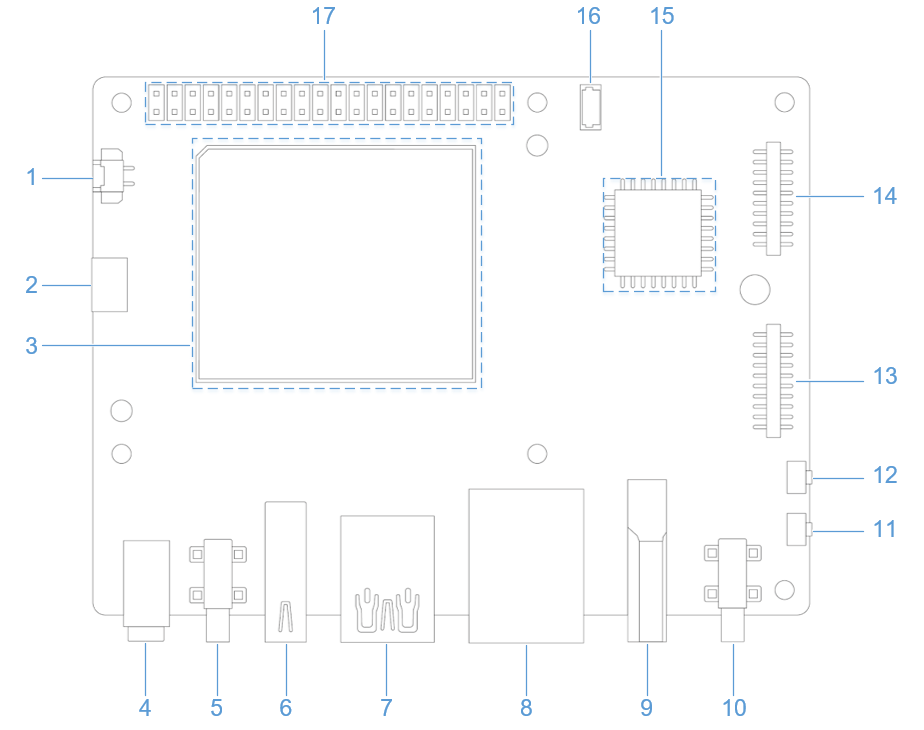
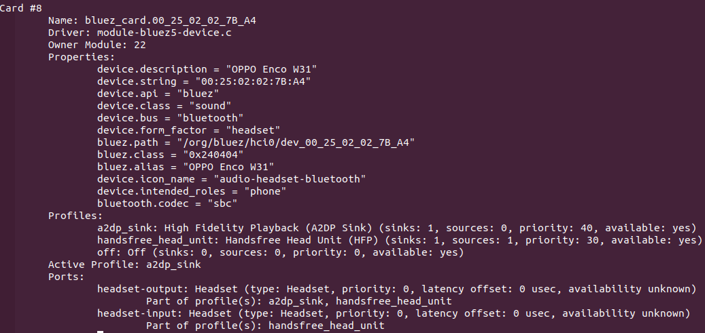
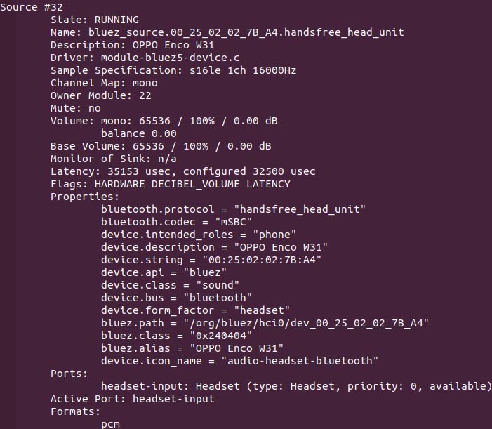

# 音频

RUBIK Pi 3 目前支持的音接口为：

* 3.5mm 耳机，下图4。

* HDMI OUT， 下图9。

* 蓝牙



## 使能音频功能
    1. 将 Qualcomm 和魔方派公共个人软件包档案 (PPA) 添加到您的魔方派 3 Ubuntu 软件源。
    ```shell
    sudo add-apt-repository ppa:ubuntu-qcom-iot/qcom-noble-ppa
    sudo sed -i '$a deb http://apt.rubikpi.ai ppa main' /etc/apt/sources.list
    sudo apt update
    ```
    2. 使用如下命令安装音频相关的软件包, 安装完成后, 重启设备，使能音频。
    ```shell
    sudo apt install libsndfile1 libltdl7 libspeexdsp1 qcom-fastrpc1 \
    rubikpi3-tinyalsa rubikpi3-tinycompress rubikpi3-qcom-agm rubikpi3-qcom-args rubikpi3-qcom-pal \
    rubikpi3-qcom-audio-ftm rubikpi3-qcom-audioroute rubikpi3-qcom-acdbdata rubikpi3-qcom-audio-node \
    rubikpi3-qcom-kvh2xml rubikpi3-qcom-pa-bt-audio rubikpi3-qcom-sva-capi-uv-wrapper rubikpi3-qcom-sva-cnn \
    rubikpi3-qcom-sva-listen-sound-model rubikpi3-qcom-sva-eai rubikpi3-qcom-pa-pal-voiceui rubikpi3-qcom-pa-pal-acd \
    rubikpi3-qcom-audio-plugin-headers rubikpi3-qcom-dac-mer-testapp rubikpi3-qcom-dac-plugin rubikpi3-qcom-mercury-plugin \
    rubikpi3-pulseaudio rubikpi3-diag rubikpi3-dsp rubikpi3-libdmabufheap rubikpi3-qcom-vui-interface rubikpi3-qcom-vui-interface-header \
    rubikpi3-time-genoff rubikpi3-pa-pal-plugins

    sudo usermod -aG audio,pulse,plugdev,video,render ubuntu  # ubuntu 按实际情况更换，用户名
    ```

* 在魔方派 3 中输入下面命令，查看声卡挂载情况：
```shell
cat /proc/asound/cards
```


## 设置输出源

在魔方派 3 中输入下面命令，改变pulseaudio相关命令的音频输出源头：

* 设置输出接口为 3.5mm Headset
```shell
pactl set-default-sink low-latency0
pactl set-sink-port low-latency0 headset
```
* 设置输出接口为 HDMI OUT
```shell
pactl set-default-sink low-latency0
pactl set-sink-port low-latency0 hdmi-out
```

* 设置输出接口为 Bluetooth，请参考 [蓝牙](#blue) 章节，确保蓝牙已连接
    * 执行以下命令，确认当前的蓝牙设备支持的音频信息，不同的蓝牙设备之间存在差异
    ```shell
    pactl list cards
    ```
    示例输出
    

    * 执行以下命令，切换蓝牙音频输出Profile
    ```shell
    pactl set-card-profile <Card-Name> <Profile>
    ```
    示例
    ```shell
    # 切换到通话模式 (HFP/HSP)
    pactl set-card-profile bluez_card.00_25_02_02_7B_A4 handsfree_head_unit
    ```
    * 执行以下命令，查看蓝牙相关source信息
    ```shell
    pactl list sources
    ```
    示例输出
    

    * 执行以下命令，切换蓝牙音频输入接口
    ```shell
    pactl set-default-source <Source-Name>
    ```
    示例
    ```shell
    pactl set-default-source bluez_source.00_25_02_02_7B_A4.handsfree_head_unit
    ```

## 播放
:::warning
1. 执行以下命令创建 */opt* 目录，并确保 */opt* 路径存在可读写权限
2. 运行命令前，务必将 MP3 测试文件 (`<FileName>.mp3`) 推送到 */opt* 目录下
:::

```shell
mkdir /opt
sudo chmod 777 -R /opt
```
* 在魔方派 3 中输入下面命令测试 .mp3音频播放。
```shell
paplay /opt/<FileName>.mp3
```

## 录制
* 在魔方派 3 中输入下面命令测试 .mp3音频录制。
```shell
parecord /opt/<FileName>.mp3
```

## 调节音量大小
* 调整播放音量大小
    * 执行以下命令，查看输出设备音量
    ```shell
    pactl list sinks | grep -e "Name" -e "Volume" -e "Active Port"
    ```
    示例输出
    
    * 执行以下命令，调整当前输出设备音量大小
    ```shell
    pactl set-sink-volume <Sink-Name> <Volume>
    ```
    示例
    ```shell
    pactl set-sink-volume low-latency0 70%
    ```

* 调整录音音量大小
    * 执行以下命令，查看输出设备音量
    ```shell
    pactl list sources | grep -e "Name" -e "Volume" -e "Active Port"
    ```
    示例输出
    
    * 执行以下命令，调整当前输出设备音量大小
    ```shell
    pactl set-source-volume <Source-Name> <Volume>
    ```
    示例
    ```shell
    pactl set-source-volume regular0 70%
    ```

## 抓取日志

* 用户空间日志

  要抓取用户空间日志，请执行以下操作：

  ```shell

  cat /var/log/user.log
  ```

* 内核音频驱动程序日志

  要抓取内核日志，请执行以下操作：

  * &#x20;内核日志

    ```shell
    dmesg
    ```

  * 禁用特定文件中的内核日志：

    ```shell
    echo –n “file <filename> -p” > /sys/kernel/debug/dynamic_debug/control

    ```

  * 动态内核日志

    默认情况下，动态日志处于禁用状态。要将其启用，请添加 `CONFIG_DYNAMIC_DEBUG` 内核配置，重新编译并重新刷写设备。

    要启用音频动态内核日志，请执行以下操作：

    ```shell
    ssh root@ip-addr
    mount -o rw,remount /
    mount -t debugfs none /sys/kernel/debug
    echo –n “file <filename> +p” > /sys/kernel/debug/dynamic_debug/control
    ```

## 分析抓取的日志

查看用户空间日志和内核音频驱动程序日志，了解播放和录制用例。

* 播放

  以下日志片段描述了为播放用例收集的信息。

  ```shell
  //Open Low latency Playback stream. Details of each stream type can be found at sources/audio/opensource/arpal-lx/inc/PalDefs.h
  2022-04-28T18:02:08.748280+00:00 pulseaudio: pal_stream_open: 224: Enter, stream type:1

  //Verify the backend device, sample rate, bitwidth, channels etc
  2022-04-28T18:02:08.748627+00:00 pulseaudio: setDeviceMediaConfig: 1056: CODEC_DMA-LPAIF_WSA-RX-0 rate ch fmt data_fmt 48000 2 2 1

  //Start playback stream
  2022-04-28T18:02:08.751947+00:00 pulseaudio: pal_stream_start: 338: Enter. Stream handle 0xffff94001040K

  //Map the metadata with kvh2xml.h file for playback usecase details.
  2022-04-28T18:02:08.853157+00:00 pulseaudio: metadata_print: 82 key:0xa1000000, value:0xa100000e//PCM_LL_PLAYBACK
  2022-04-28T18:02:08.853395+00:00 pulseaudio: metadata_print: 82 key:0xab000000, value:0x1
  2022-04-28T18:02:08.853660+00:00 pulseaudio: metadata_print: 82 key:0xa2000000, value:0xa2000001//Speaker
  2022-04-28T18:02:08.853881+00:00 pulseaudio: metadata_print: 82 key:0xac000000, value:0xac000002//DEVICEPP_RX_AUDIO_MBDRC

  //Verify the graph opened for playback usecase
  2022-04-28T18:02:08.856934+00:00 pulseaudio: print_graph_alias: 2334 GKV Alias 142 | StreamRX_PCM_LL_Playback_DeviceRX_Speaker_Instance_Instance_1_DevicePP_Rx_Audio_MBDRC
  //graph_open called
  2022-04-28T18:02:08.859509+00:00 pulseaudio: graph_open: 709 graph_handle 0x47534c

  //Configure hardware endpoint module
  2022-04-28T18:02:08.864386+00:00 pulseaudio: configure_hw_ep_media_config: 636 entry mod tag c0000004 miid 43b1 mid 7001023
  2022-04-28T18:02:08.864495+00:00 pulseaudio: configure_hw_ep_media_config: 664 rate 48000 bw 16 ch 2, data_fmt 1
  2022-04-28T18:02:08.864603+00:00 pulseaudio: configure_hw_ep_media_config: 676 exit, ret 0

  //graph_start entry
  2022-04-28T18:02:08.867234+00:00 pulseaudio: graph_start: 899 entry graph_handle 0x47534c
  //Stream started
  2022-04-28T18:02:08.867864+00:00 pulseaudio: pal_stream_start: 387: Exit. status 0

  //graph_stop entry
  2022-04-28T18:02:25.037338+00:00 pulseaudio: graph_stop: 928 entry graph_handle 0x47534c
  //Stop the PAL stream once playback completes
  2022-04-28T18:02:25.039923+00:00 pulseaudio: pal_stream_stop: 441: Exit. status 0

  //graph_close entry
  2022-04-28T18:02:25.050944+00:00 pulseaudio: graph_close: 762 entry handle 0x47534c
  //Close the PAL stream
  2022-04-28T18:02:25.054510+00:00 pulseaudio: pal_stream_close: 322: Exit. status 0

  ```

* 录制

  以下日志片段描述了为录制用例收集的信息。

  ```shell
  //Open Recording stream for PAL_STREAM_RAW. Details of stream type can be found at sources/audio/opensource/arpal-lx/inc/PalDefs.h
  Apr 29 09:23:11 pulseaudio[862]: pal_stream_open: 224: Enter, stream type:9

  //Verify the backend device, sample rate, bitwidth, channels etc
  Apr 29 09:23:11 pulseaudio[862]: setDeviceMediaConfig: 1056: CODEC_DMA-LPAIF_VA-TX-0 rate ch fmt data_fmt 48000 1 2 1

  //Start recording stream
  Apr 29 09:23:11 pulseaudio[862]: pal_stream_start: 338: Enter. Stream handle 0xffff6c001040K

  //graph_open entry
  Apr 29 09:23:11 pulseaudio[862]: graph_open: 709 graph_handle 0x47534c

  //Metadata details to identify the usecase
  Apr 29 09:23:11 pulseaudio[862]: metadata_print: 82 key:0xb1000000, value:0xb1000009//RAW_RECORD
  Apr 29 09:23:11 pulseaudio[862]: metadata_print: 82 key:0xa3000000, value:0xa3000004//HANDSETMIC

  //Verify the graph opened for recording usecase
  Apr 29 09:23:11 pulseaudio[862]: print_graph_alias: 2334 GKV Alias 29 | DeviceTX_Handset_Mic_StreamTX_RAW_Record

  //Configure hardware endpoint module
  Apr 29 09:23:11 pulseaudio[862]: configure_hw_ep_media_config: 636 entry mod tag c0000005 miid 43af mid 7001024
  Apr 29 09:23:11 pulseaudio[862]: configure_hw_ep_media_config: 664 rate 48000 bw 16 ch 1, data_fmt 1
  Apr 29 09:23:11 pulseaudio[862]: configure_hw_ep_media_config: 676 exit, ret 0

  //graph_start entry
  Apr 29 09:23:11 pulseaudio[862]: graph_start: 899 entry graph_handle 0x47534c
  //Stream recording started
  Apr 29 09:23:11 pulseaudio[862]: pal_stream_start: 387: Exit. status 0


  //graph_stop entry
  Apr 29 09:23:26 pulseaudio[862]: graph_stop: 928 entry graph_handle 0x47534c
  //Stop the PAL stream once user stops recording
  Apr 29 09:23:26 pulseaudio[862]: D: [regular2] pal-source.c: pal_stream_stop returned 0

  //Close the PAL stream
  Apr 29 09:23:26 pulseaudio[862]: pal_stream_close: 284: Enter. Stream handle :0xffff6c001040K
  //graph_close entry
  Apr 29 09:23:26 pulseaudio[862]: graph_close: 762 entry handle 0x47534c
  //Close the PAL stream
  Apr 29 09:23:26 pulseaudio[862]: pal_stream_close: 322: Exit. status 0

  ```
