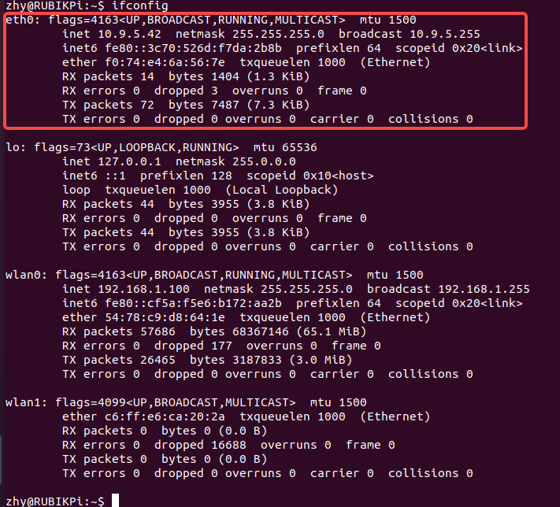

# 以太网

以太网技术旨在使用有线技术以不同的链路速度传输数据。它使用线缆在网络模型（例如局域网 (LAN) 和广域网 (WAN)）中传输数据，实现可靠、安全和更出色的网络连接。

以太网连接集成到 IoT 设备和传感器，使它们能够将数据传输到网络。它根据 IEEE 802.3 标准定义，可为这些设备提供用于与网关通信的标准化接口。

以太网接口为下图 8， RUBIK Pi 3 支持千兆以太网：


接入网线，如下图所示：


可在 RUBIK Pi 3 中使用 `ifconfig` 命令查看网络连接情况，如下图所示，已经成功分配 IP，说明网络连接成功：


:::note
>
> 可输入命令 `sudo apt install net-tools` 安装 ifconfig 命令。
:::

## 调试以太网

可以使用以下日志类型来记录和调试与以太网有关的问题。

* `dmesg`：调试与内核驱动程序相关的问题

* `tcpdump`： 验证数据包传输

要调试在以太网调通期间可能出现的问题，请执行以下操作：

1. 要收集 `dmesg` 日志并调试与内核驱动程序有关的问题，请运行以下命令：

   ```shell
   dmesg > /var/log/dmesg_logs.txt
   ```

2. 要收集 `tcpdump` 日志并验证数据包传输，请运行以下命令。

   ```shell
   tcpdump -i any -s 0 -w /var/log/tcpdump.pcap
   ```

3. 收集来自 `ethtool`、`ifconfig`、`netstat` 和 IP 路由表的输出以进行调试。