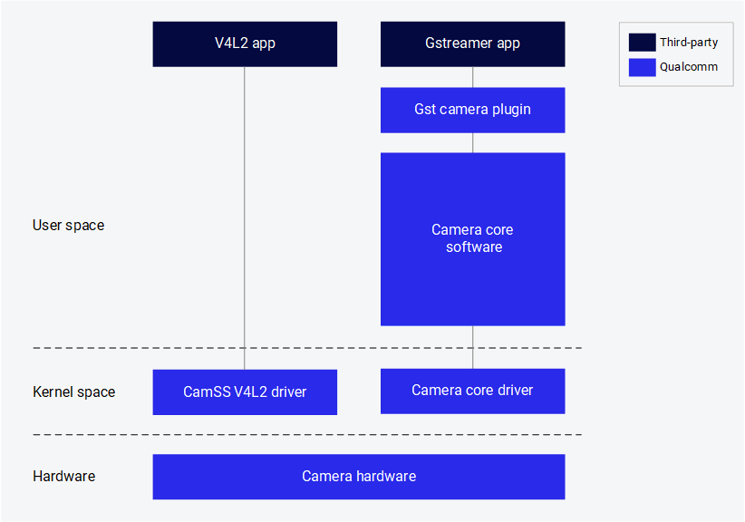
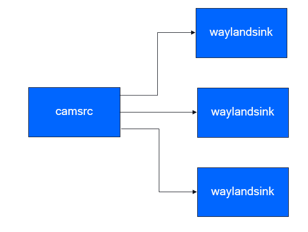
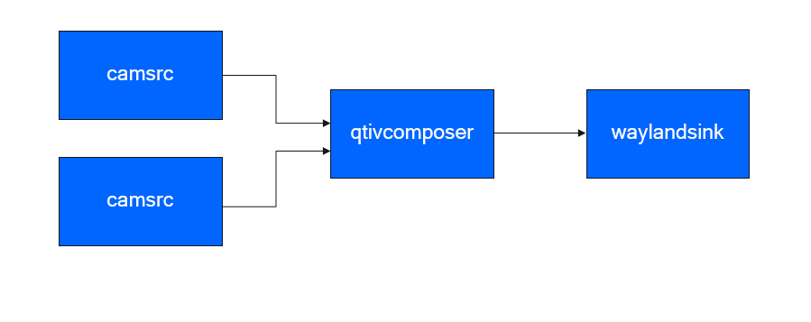

# 摄像头软件

## 摄像头概述

本章节介绍了通过 MIPI CSI 接口接收数据的摄像头子系统。

USB 摄像头数据通过 USB 接口传输，摄像头子系统不涉及 USB 摄像头数据传输。请参阅USB章节了解 USB 摄像头的使用。

网络摄像头数据通过网络接口传输，摄像头子系统不涉及网络摄像头数据传输。设备可以通过 GStreamer [rtspsrc](https://gstreamer.freedesktop.org/documentation/rtsp/rtspsrc.html?gi-language=c) 插件接收网络摄像头数据。


下图显示了 Qualcomm 摄像头的组件。



以下组件由 Qualcomm 提供：

| 组件                        | 说明                                                                                     |
|-----------------------------|-----------------------------------------------------------------------------------------|
| GST 摄像头插件 (qtiqmmfsrc)  | Qualcomm 摄像头子系统的 GStreamer 插件                                                  |
| 摄像头核心软件               | Qualcomm 专有的摄像头软件，提供开发摄像头传感器驱动程序、摄像头调整和自定义软件节点的接口 |
| 摄像头核心驱动程序           | 下游 Linux 内核中的 Qualcomm 摄像头子系统驱动程序                                       |
| CamSS V4L2 驱动程序          | 上游 Linux 内核中的 Qualcomm 摄像头子系统驱动程序                                       |

## 摄像头流传输

Qualcomm 提供了一个 GStreamer 插件，使应用程序开发者能够与 Qualcomm 摄像头子系统进行交互。


**前提条件**

启用显示屏：

```plain&#x20;text
sudo -i
systemctl stop gdm
sudo dpkg-reconfigure weston-autostart
export XDG_RUNTIME_DIR=/run/user/$(id -u ubuntu)
```


### 单摄像头流启动

1. 在设备终端运行以下命令，在 30 FPS 配置下以 720p 启动摄像头。来自摄像头传感器的帧被 fakesink 丢弃。

```plain&#x20;text
gst-launch-1.0 -e qtiqmmfsrc name=camsrc camera=0 ! 'video/x-raw,format=NV12,\
width=1280,height=720,framerate=30/1' ! fakesink
```

1. 如果 gst pipeline 状态更改为 “PLAYING”，如下所示，则表示摄像头正在运行。由于此命令会将摄像头帧 dump 到 fakesink，因此不会在设备上保存任何内容。

```plain&#x20;text
Setting pipeline to PAUSED ...
Pipeline is live and does not need PREROLL ...
Setting pipeline to PLAYING ...
New clock: GstSystemClock
```


### 视频编码

1. 在设备终端运行以下命令，以 720p、30 FPS 配置启动摄像头，并在 h264 视频编码后将其另存为视频文件。

```plain&#x20;text
gst-launch-1.0 -e qtiqmmfsrc name=camsrc camera=0 ! \
video/x-raw,format=NV12,width=1280,height=720,framerate=30/1,\
interlace-mode=progressive,colorimetry=bt601 ! v4l2h264enc \
capture-io-mode=4 output-io-mode=5 extra-controls="controls,video_bitrate=6000000,\
video_bitrate_mode=0;" ! h264parse ! mp4mux ! filesink location=/opt/mux_avc.mp4
```

如果 gst pipeline 状态更改为 “PLAYING”，则表示摄像头正在运行。


2. 在设备上生成 `/opt/mux_avc.mp4`。通过在主机 PC 上运行以下 scp 命令，可以从设备中提取录制的内容：

```plain&#x20;text
$ scp -r root@[ip-addr]:/opt/mux_avc.mp4 .
```


### 视频编码和拍照

1. 在设备终端运行以下命令：

```plain&#x20;text
gst-pipeline-app -e qtiqmmfsrc name=camsrc camera=0 ! \
video/x-raw,format=NV12,width=1280,height=720,framerate=30/1,\
interlace-mode=progressive,colorimetry=bt601 ! v4l2h264enc \
capture-io-mode=4 output-io-mode=5 extra-controls="controls,video_bitrate=6000000,\
video_bitrate_mode=0;" ! h264parse ! mp4mux ! filesink location=/opt/mux_avc.mp4 \
camsrc.image_1 ! "image/jpeg,width=1280,height=720,framerate=30/1" \
! multifilesink location=/opt/frame%d.jpg async=false sync=true enable-last-sample=false
```

2. 按下 Enter。此命令将打印以下菜单并等待用户输入。

```plain&#x20;text
##################################### MENU #####################################

============================== Pipeline Controls==============================
(0) NULL: Set the pipeline into NULL state
(1) READY: Set the pipeline into READY state
(2) PAUSED: Set the pipeline into PAUSED state
(3) PLAYING: Set the pipeline into PLAYING state

==================================== Other====================================
(p) Plugin Mode: Choose a plugin which to control
(q) Quit : Exit the application

Choose an option:

```

3. 使用以下菜单步骤在录制视频时拍照。

```plain&#x20;text
(1) ready -> (3) Playing -> (p)Plugin Mode : Select (8)camerasrc -> (37) capture-image -> (1): still - Snapshot ->(1) Snapshot count ( 'guint' value for arg1)
```

4. 若要停止摄像头，按 Enter，按 b（返回），然后按 q（退出）。录制的视频文件和拍照图像保存在 `/opt/` 中。通过在主机 PC 上运行以下 scp 命令，可以从设备中提取录制的内容：

```plain&#x20;text
$ scp -r root@[ip-addr]:/opt/<file name> .
```


### **摄像头内容预览**

```plain&#x20;text
gst-launch-1.0 -e qtiqmmfsrc name=camsrc video_1::type=preview ! video/x-raw,format=NV12,width=1920,height=1080,framerate=30/1,interlace-mode=progressive,colorimetry=bt601 ! waylandsink fullscreen=true sync=false
```

此 pipeline 显示从摄像头获取并发送到显示器的单个 1080p 流。


### 显示三路 720p YUV 视频流

```bash
gst-launch-1.0 -e qtivcomposer name=mixer sink_0::position="<0, 0>" sink_0::dimensions="<480, 270>" sink_1::position="<480, 0>" sink_1::dimensions="<480, 270>" sink_2::position="<960, 0>" sink_2::dimensions="<480, 270>" mixer. ! queue ! waylandsink fullscreen=true qtiqmmfsrc name=camsrc camera=0 video_0::type=preview video_1::type=video ! video/x-raw,format=NV12_Q08C,width=1280,height=720,framerate=30/1,interlace-mode=progressive,colorimetry=bt601 ! queue ! mixer. camsrc. ! video/x-raw,format=NV12,width=1280,height=720,framerate=30/1,interlace-mode=progressive,colorimetry=bt601 ! queue ! mixer. camsrc. ! video/x-raw,format=NV12,width=1280,height=720,framerate=30/1,interlace-mode=progressive,colorimetry=bt601 ! queue ! mixer.
```

该 pipeline 展示从摄像头中获取三个 720p 流并发送到显示器，每个流显示在屏幕上的不同位置。



### 使用套接字传输摄像头流

该用例展示了如何将摄像头流存储在套接字中。然后，将套接字中的摄像头流编码为 AVC 格式并存储在文件中。

在控制台 1 中：

```plain&#x20;text
gst-launch-1.0 -e qtisocketsrc socket=/tmp/input.sock ! video/x-raw,format=NV12,width=1920,height=1080,framerate=30/1,interlace-mode=progressive,colorimetry=bt601 ! v4l2h264enc capture-io-mode=4 output-io-mode=5 ! h264parse ! mp4mux ! queue ! filesink location=/opt/video.mp4
```

在控制台 2 中：

```plain&#x20;text
gst-launch-1.0 -e qtiqmmfsrc name=camsrc ! video/x-raw,format=NV12,width=1920,height=1080,framerate=30/1 ! qtisocketsink socket=/tmp/input.sock
```

下图显示了 pipeline 执行流程：


### 来自实时源的 4K AVC 和 480p AVC 流

这些用例对来自摄像头的一路 4K 流和一路 1080p 流进行编码。每个编码的数据流都多路复用到不同的文件中。

```c++
gst-launch-1.0 -e qtiqmmfsrc name=camsrc video_0::type=preview ! video/x-raw,format=NV12_Q08C,width=3840,height=2160,framerate=30/1,interlace-mode=progressive,colorimetry=bt601 ! queue ! v4l2h264enc capture-io-mode=4 output-io-mode=5 ! queue ! h264parse ! mp4mux ! queue ! filesink location="/opt/mux1.mp4" camsrc. ! video/x-raw,format=NV12_Q08C,width=640,height=480,framerate=30/1,interlace-mode=progressive,colorimetry=bt601 ! queue ! v4l2h264enc capture-io-mode=4 output-io-mode=5 ! queue ! h264parse ! mp4mux ! queue ! filesink location="/opt/mux2.mp4"
```

下图显示了 pipeline 执行流程：


### 来自实时源的三个 1080p AVC 数据流

该用例对来自摄像头的三路 1080p 流进行编码。每个编码的数据流都多路复用到不同的文件中。

```c++
gst-launch-1.0 -e qtiqmmfsrc name=camsrc video_0::type=preview ! video/x-raw,format=NV12_Q08C,width=1920,height=1080,framerate=30/1,interlace-mode=progressive,colorimetry=bt601 ! queue ! v4l2h264enc capture-io-mode=4 output-io-mode=5 ! queue ! h264parse ! mp4mux ! queue ! filesink location="/opt/mux1.mp4" camsrc. ! video/x-raw,format=NV12_Q08C,width=1920,height=1080,framerate=30/1,interlace-mode=progressive,colorimetry=bt601 ! queue ! v4l2h264enc capture-io-mode=4 output-io-mode=5 ! queue ! h264parse ! mp4mux ! queue ! filesink location="/opt/mux2.mp4" camsrc. ! video/x-raw,format=NV12_Q08C,width=1920,height=1080,framerate=30/1,interlace-mode=progressive,colorimetry=bt601 ! queue ! v4l2h264enc capture-io-mode=4 output-io-mode=5 ! queue ! h264parse ! mp4mux ! queue ! filesink location="/opt/mux3.mp4"
```

下图显示了 pipeline 执行流程：


## 多摄像头显示

多摄像头/多客户端用例展示了以画中画、并排等模式显示多路摄像头视频流的场景。

### 两路 720p 流 - 每个摄像头各一路，采用并排拼接方式显示

该 pipeline 展示了分别来自主摄像头和辅助摄像头的两路 720p 流。这两路流并排合成后进行显示。

```bash
gst-launch-1.0 -e qtivcomposer name=mixer sink_0::position="<0, 0>" sink_0::dimensions="<640, 360>" sink_1::position="<640, 0>" sink_1::dimensions="<640, 360>" mixer. ! queue ! waylandsink enable-last-sample=false fullscreen=true qtiqmmfsrc name=camsrc_0 camera=0 ! video/x-raw, format=NV12, width=1280, height=720, framerate=30/1 ! mixer. qtiqmmfsrc name=camsrc_1 camera=1 ! video/x-raw, format=NV12, width=1280, height=720, framerate=30/1 ! mixer.

```

下图显示了 pipeline 执行流程：




### 两路 720p 流 - 每个摄像头各一路，采用画中画合成方式

用例使用分别来自主摄像头和辅助摄像头的两路 720p 流。两者均以画中画形式组成并显示。

运行 pipeline：

```bash
gst-launch-1.0 -e qtivcomposer name=mixer sink_0::position="<0, 0>" sink_0::dimensions="<1280, 720>" sink_1::position="<590, 310>" sink_1::dimensions="<640, 360>" mixer. ! queue ! waylandsink enable-last-sample=false fullscreen=true qtiqmmfsrc name=camsrc_0 camera=0 ! video/x-raw, format=NV12, width=1280, height=720, framerate=30/1 ! mixer. qtiqmmfsrc name=camsrc_1 camera=1 ! video/x-raw, format=NV12, width=1280, height=720, framerate=30/1 ! mixer.

```

## 转换和转码

以下用例展示了调整摄像头中场景的过程。

### 旋转

用例展示了将摄像头中的场景旋转 180 度的过程。旋转后的图像显示在本地显示器上。

```bash
gst-launch-1.0 -e qtiqmmfsrc name=camsrc video_0::type=video video_1::type=preview ! video/x-raw,format=NV12,width=1920,height=1080,framerate=30/1 ! qtivtransform engine=gles rotate=180 ! waylandsink fullscreen=true async=false sync=false
```

下图显示了 pipeline 执行流程：


:::tip

目前只支持180度旋转。

:::

### 水平翻转

```typescript
gst-launch-1.0 -e qtiqmmfsrc name=camsrc video_0::type=video video_1::type=preview ! video/x-raw,format=NV12,width=1920,height=1080,framerate=30/1 ! qtivtransform engine=gles flip-horizontal=true ! waylandsink fullscreen=true
```


### 垂直翻转

```plain&#x20;text
gst-launch-1.0 -e qtiqmmfsrc name=camsrc video_0::type=video video_1::type=preview ! video/x-raw,format=NV12,width=1920,height=1080,framerate=30/1 ! qtivtransform engine=gles flip-vertical=true ! waylandsink fullscreen=true
```


# 故障排除

如果摄像头无法显示或捕捉图像，请检查以下内容：

1. 参阅 [摄像头排线安装](2.外设与接口/3.CSI.md#cameracable)检查摄像头模块连接。

2. 检查传感器探头。
   
    1. 使用以下命令收集日志

       ```shell
       journalctl -f > /opt/log.txt
       ```

    2. 在日志中搜索 "probe success" 。Probe success 意味着摄像头模块已通电并响应 I2C 控制。如果特定传感器没有 "probe success" 日志，则可能是柔性电缆连接或摄像头模块的问题。
       
       以下日志指示探测到一个 IMX477：

       ```shell
       [   80.645992] CAM_INFO: CAM-SENSOR: cam_sensor_driver_cmd: 939: Probe success,slot:7,slave_addr:0x34,sensor_id:0x477, is always on: 0
       ```

3. 检查摄像头传感器驱动程序命令

    1. 使用 `journalctl -f > /opt/log.txt`命令收集日志.
   
    2. 搜索 "cam\_sensor\_driver\_cmd" 。
   
       - "CAM\_START\_DEV Success" 表示摄像头传感器流式传输开始。
        
       - "CAM\_STOP\_DEV Success" 表示摄像头传感器流式传输停止。
        
       例如：

       ```shell

       start:
       [   81.172814] CAM_INFO: CAM-SENSOR: cam_sensor_driver_cmd: 1129: CAM_START_DEV Success, sensor_id:0x477,sensor_slave_addr:0x34
       stop:
       [   88.905241] CAM_INFO: CAM-SENSOR: cam_sensor_driver_cmd: 1157: CAM_STOP_DEV Success, sensor_id:0x477,sensor_slave_addr:0x34
       ```

4. 检查传感器流式传输.

    1. 启用 CSID SOF/EOF IRQ 日志，随后执行摄像头出流命令

    ```shell
    mount -o rw,remount /usr
    mount -t debugfs none /sys/kernel/debug/
    echo 0x8 > /sys/module/camera/parameters/debug_mdl
    echo 3 >/sys/kernel/debug/camera_ife/ife_csid_debug
    echo 1 > /sys/kernel/tracing/tracing_on
    echo 1 > /sys/kernel/tracing/events/camera/cam_log_debug/enable
    echo 2 > /sys/module/camera/parameters/debug_type
    cat /sys/kernel/tracing/trace_pipe > trace.txt
    ```

    2. 捕获的日志有助于提供有关 SOF 和 EOF 的详细信息。在日志 "trace.txt" 中搜索 "irq\_status\_ipp"。

       * BIT12(0x1000)表示 SOF 数据包

       * BIT9(0x200)表示 EOF 数据包。

       日志如下所示：

       ```shell
       <idle>-0       [000] d.h1. 19287.546764: cam_log_debug:
       CAM_DBG: CAM-ISP: cam_ife_csid_irq: 4996: irq_status_ipp = 0x1110 cam-server-25604     [000] dNH.. 19287.561705: cam_log_debug:
       CAM_DBG: CAM-ISP: cam_ife_csid_irq: 4996: irq_status_ipp = 0xee8
       ```

